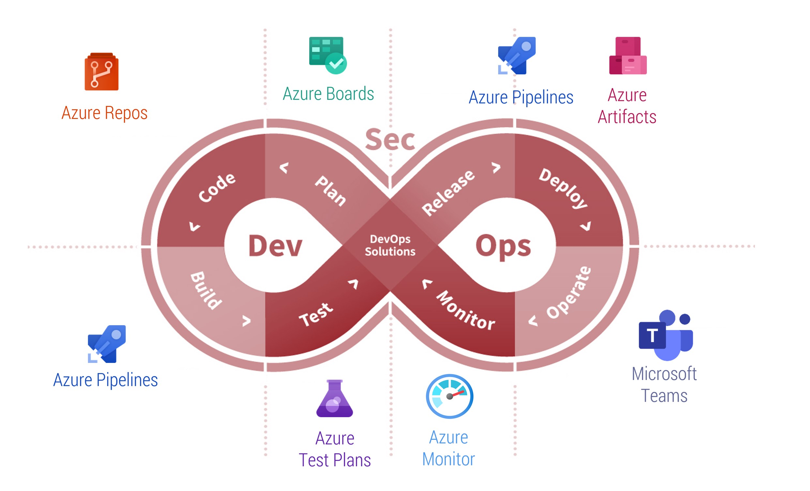

# Azure DevOps

## Was ist DevOps?

DevOps ist die Verbindung von **Menschen**, **Prozessen** und **Produkten**, die eine kontinuierliche Bereitstellung von
Mehrwerten für Ihre Endnutzer ermöglicht.

## Was ist das Azure DevOps?

Moderner Entwicklungsdienst, um 
**besser planen**, **einfacher** im Team **zusammenarbeiten** und Code **schneller ausliefern** zu können.

