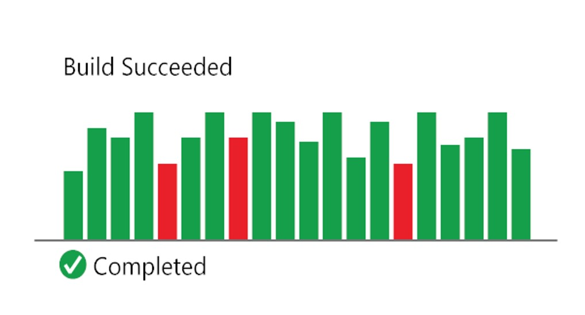
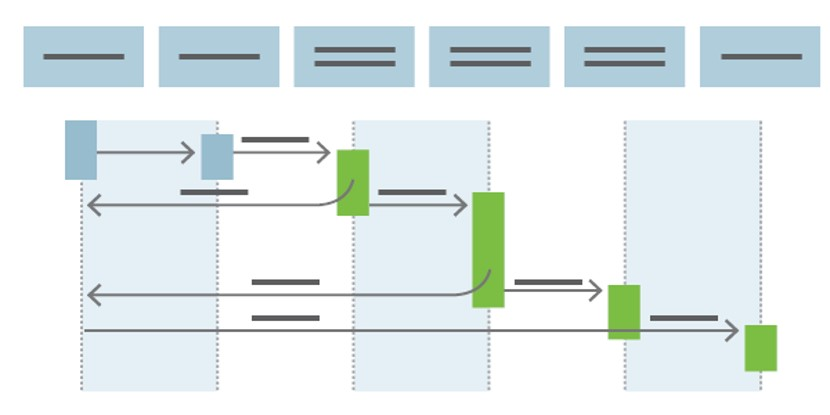

# CI/CD

## Continuous Integration (CI)

- Prozess der Automatisierung des Builds   
- Testens von Code bei jeder Änderung

Das Comitten von Code löst ein **automatisiertes Build-System** aus, das den neuesten Code aus dem gemeinsamen Repository holt und den vollständigen **Main-Branch** baut und validiert.

## Continuous Deployment (CD)

- Bauen, Testen, Konfigurieren 
- Bereitstellen eines Builds in eine Umgebung 

Die kontinuierliche Integration startet den CD-Prozess und die Pipeline führt nach erfolgreichem Abschluss der Tests jede aufeinander folgende Umgebung zur nächsten.

## Links
[Was ist DevOps? - Azure DevOps | Microsoft Docs](https://docs.microsoft.com/de-de/devops/what-is-devops)  