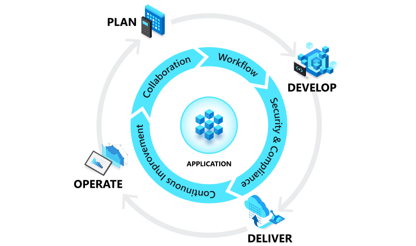
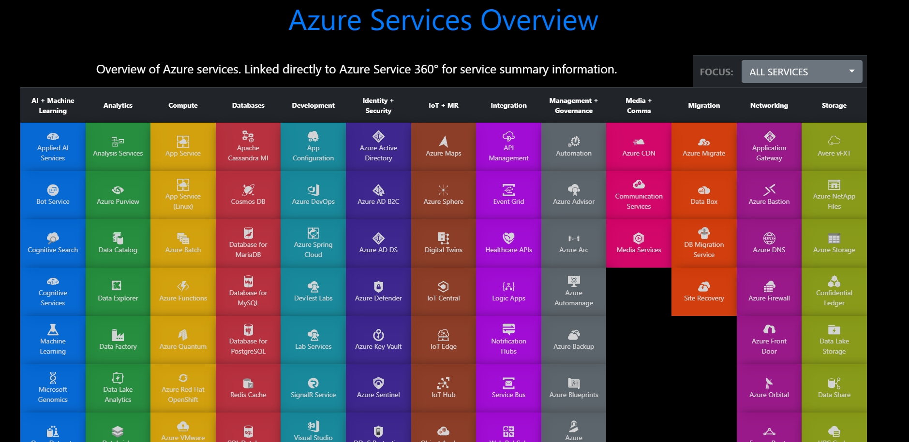

# Usecases

Mit Azure DevOps und den Pipelines gibt es keine Grenzen. (Fast) Alle Dienste, die Microsoft Azure anbietet, können mit den Pipelines ausgebracht und der Inhalt deployed werden.  

## Infrastruktur as a Code  
Azure Bicep, Terraform oder ARM Deployments können ebenfalls mit Azure DevOps Pipelines ausgebracht werden.  
  

## Links
[Azure Services Overview](https://azurecharts.com/overview)  
[Azure Bicep](https://docs.microsoft.com/de-de/azure/azure-resource-manager/bicep/overview)  
[Terraform](https://www.terraform.io/)  