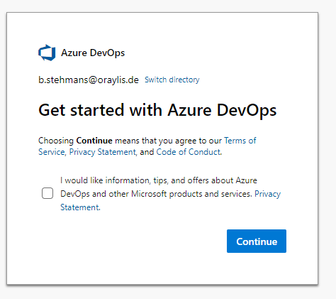
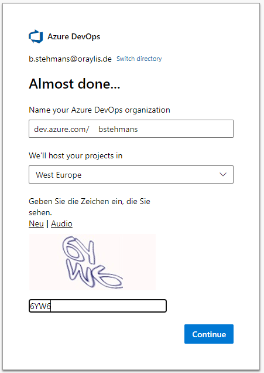
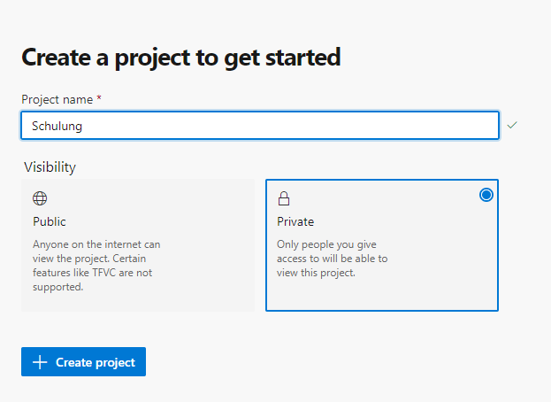
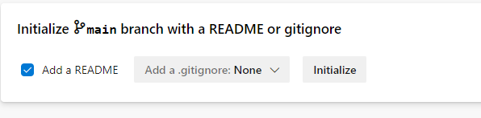
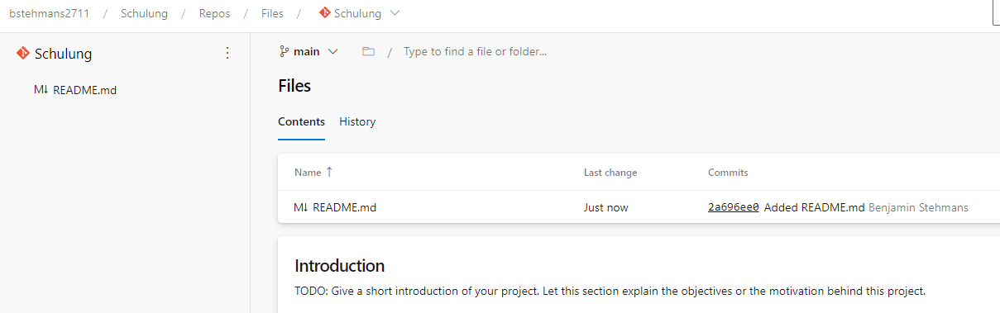
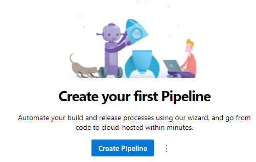
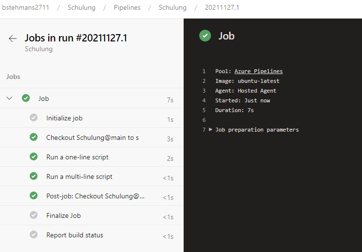
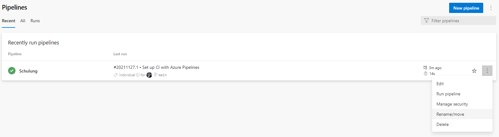

# Let's go

## Discalaimer
Jedes **Projekt** und die damit verbundenen Anforderungen sind **unterschiedlich**. Wir können heute keine Standards für alle Deployments finden. Wichtig ist es ein Gefühl für Azure Pipelines zu bekommen und ein erstes begleitetes Hands-On zu erleben. 

## Eigenes Projekt erstellen
Wir erstellen unser eigenes Projekt:  
1. Öffnet [dev.azure.com](https://dev.azure.com/)    
2. Login mit dem ORAYLIS Account  
3. Klickt *New Organisation*   
     
4. Terms and Condition -> Continue  
5. Vergebt einen Organisationsnamen  
6. In West Europe  
7. Solve the Captcha  
  
8. Vergebt einen Projektnamen **Schulung**   
9. Klickt **+ Create project** 
  
10. Klickt auf Repos dann **Initialize**    
  


 

## Pipeline Erstellen

1. Klickt auf Pipelines    
2. Create Pipeline  
  
3. Wählt Azure Repos Git   
4. Wählt Schulung   
5. Wählt Starter Pipeline  
6. Ändert den Namen in **build.yml** 
7. Save and Run   
```yaml
# Starter pipeline
# Start with a minimal pipeline that you can customize to build and deploy your code.
# Add steps that build, run tests, deploy, and more:
# https://aka.ms/yaml

trigger:
- main

pool:
  vmImage: ubuntu-latest

steps:
- script: echo Hello, world!
  displayName: 'Run a one-line script'

- script: |
    echo Add other tasks to build, test, and deploy your project.
    echo See https://aka.ms/yaml
  displayName: 'Run a multi-line script'

```


## Ergebnis des Pipeline-Laufs

 


## Pipeline umbenennen

Damit wir der Pipeline den Namen Build geben können, geht bitte wie folgt vor:  
1. Wählt das ⁝ Menü 
2. Wählt im Menü   *Rename/move*   
3. Ändert den namen in **Build** 

 