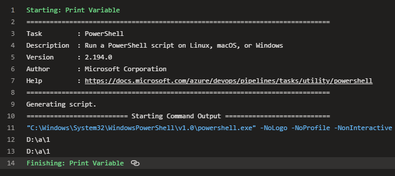
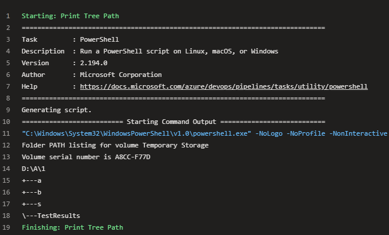
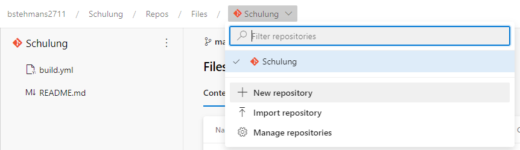
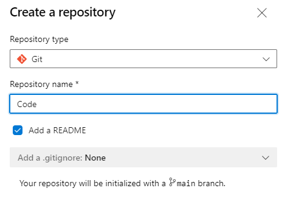
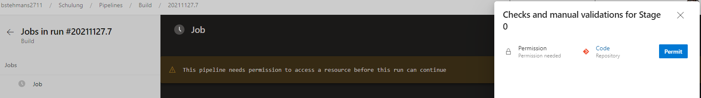
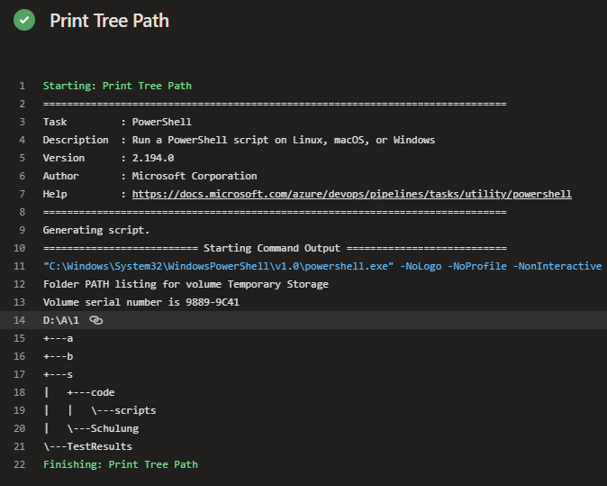
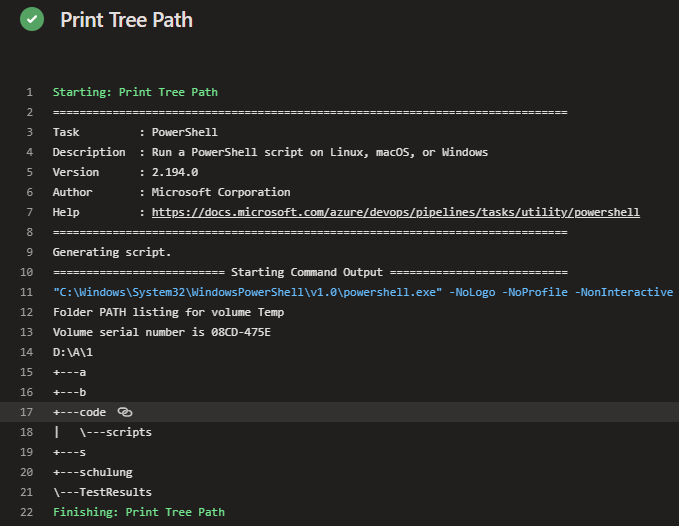

# Verzeichnisse

Damit **Code Artefakte** verarbeitet werden können müssen diese auf dem Build Agent gespeichert werden. Dazu gibt es verschiedene Möglichkeiten diese Artefakte auf den Build Agent zu bekommen. Ein **Check-out** aus dem Repository oder ein **Download** aus der Pipeline ist ebenfalls möglich.  

OS | Verzeichniss
---|---
Windows | ```D:\a\1\s```
Linux | ```/home/vsts/work/1/s```
Mac | ```/Users/runner/work/1/s```

## Best Practice - Verzeichnisse
 Wir geben jeden Pfad auf einem Verzeichniss mit dem ```/``` *Schrägstrich* an. Damit stellen wir sicher, dass Pfade auf **Windows**, **Linux** und **Mac** gelesen werden können.

## Wie gehen wir mit den Verzeichnissen auf den Verschiedenen Agents um?

Damit wir uns nicht um die verschiedenen Verzeichnisse der Agents kümmern müssen gibt es Variablen welche verwendet werden können.
Die wichtigsten im überblick: 

Variable | Beschreibung
---|---
Agent.BuildDirectory | Der lokale Pfad auf dem Agent, in dem alle Ordner für eine bestimmte Buildpipeline erstellt werden. Diese Variable hat den gleichen Wert wie Pipeline.Workspace. Beispiel: ```/home/vsts/work/1```
Build.ArtifactStagingDirectory | Der lokale Pfad auf dem Agent, in den Artefakte kopiert werden, bevor sie an ihr Ziel gepusht werden. Beispiel: ```c:\agent_work\1\a```
Build.BinariesDirectory | Der lokale Pfad auf dem Agent, den Sie als Ausgabeordner für kompilierte Binärdateien verwenden können. Standardmäßig sind keine neuen Buildpipelines zum bereinigen dieses Verzeichnisses eingerichtet. Sie können Ihren Build definieren, um ihn auf der Registerkarte Repositoryzu bereinigen. Beispiel: ```c:\agent_work\1\b```
Build.Repository.LocalPath | Der lokale Pfad auf dem Agent, in den Ihre Quellcodedateien heruntergeladen werden. Beispiel: ```c:\agent_work\1\s```
Pipeline.Workspace | Arbeitsbereichsverzeichnis für eine bestimmte Pipeline. Diese Variable hat den gleichen Wert wie ```Agent.BuildDirectory``` . Beispiel: ```/home/vsts/work/1```

## Verwendung von Variablen
Syntax | Beispiel| Wann wird er verarbeitet?| Wo wird sie in einer Pipelinedefinition erweitert? | Wie wird es gerendert, wenn es nicht gefunden wird?
---|---|---|---|---
Makro|```$(var)```|Runtime, bevor ein Task ausgeführt wird|value (rechte Seite)|	Druckt ```$(var)```


## Pipeline umbau
Ändert die **Build Pipeline** wie folgt:

### hinzufügen
```yaml
steps:
- checkout: self
```

```yaml
- task: PowerShell@2
  displayName: Print Variable
  inputs:
    targetType: inline
    script: |
      echo $(Pipeline.Workspace)
      echo $(Agent.BuildDirectory)
```

```yaml
- task: PowerShell@2
  displayName: Print Tree Path
  inputs:
    targetType: inline
    script: |
      tree $(Pipeline.Workspace) /a
```

### entfernen
```yaml
- script: echo Hello, world!
  displayName: 'Run a one-line script'```
```
```yaml
- script: |
    echo Add other tasks to build, test, and deploy your project.
    echo See https://aka.ms/yaml
  displayName: 'Run a multi-line script'
```


### build.yml
```yaml
trigger: none

pool:
  vmImage: windows-latest

steps:
- checkout: self

- task: PowerShell@2
  displayName: Print Variable
  inputs:
    targetType: inline
    script: |
      echo $(Pipeline.Workspace)
      echo $(Agent.BuildDirectory)

- task: PowerShell@2
  displayName: Print Tree Path
  inputs:
    targetType: inline
    script: |
      tree $(Pipeline.Workspace) /a
```

## Pipeline Output  
### Print Variable  
```yaml
- task: PowerShell@2
  displayName: Print Variable
  inputs:
    targetType: inline
    script: |
      echo $(Pipeline.Workspace)
      echo $(Agent.BuildDirectory)
```


### Print Tree Path

```yaml
- task: PowerShell@2
  displayName: Print Tree Path
  inputs:
    targetType: inline
    script: |
      tree $(Pipeline.Workspace) /a
```


### a|b|s Verzeichnisse

Verzeichnisse | Erklärung
--- | ---
a| Der lokale Pfad auf dem Agent, in den Artefakte kopiert werden, bevor sie an ihr Ziel gepusht werden. Beispiel: ```c:\agent_work\1\a```
b|  Der lokale Pfad auf dem Agent, den Sie als Ausgabeordner für kompilierte Binärdateien verwenden können. Standardmäßig sind keine neuen Buildpipelines zum bereinigen dieses Verzeichnisses eingerichtet. Sie können Ihren Build definieren, um ihn auf der Registerkarte Repository zu bereinigen. Beispiel: ```c:\agent_work\1\b```
s| Der lokale Pfad auf dem Agent, in den Ihre Quellcodedateien heruntergeladen werden. Beispiel: ```c:\agent_work\1\s```

## Zweites Repository
Legt ein zweites Repository mit dem Namen **Code** an geht dazu wie folgt vor.

1. Klickt auf **Repos**  
2. Klickt auf **Schulung**
3. Klickt auf **+ New repository**

4. Vergebt den Namen **Code**

5. Legt in dem Repository den ordner **scripts** an
6. Legt in dem Ordner das File an **Publish-Processes.ps1**


```powershell
<#
    .SYNOPSIS 
        File with Processes
    .DESCRIPTION 
        This .ps1 file can a file with the processes.
    .NOTES
        Author:     [EXT] Benjamin Stehmans       
    .EXAMPLE
        .\Publish-Processes.ps1 -Name "Processes.txt" -Path "C:\Test"  
            
    .PARAMETER
        Name
            Name of the file to create 
        Path 
            Path to place the file                    
        
#>
[CmdletBinding()]
Param (
    [Parameter(Mandatory = $true, Position = 1, HelpMessage = "Name of the file.")]
    [String]$Name, 
    [Parameter(Mandatory = $true, Position = 2, HelpMessage = "Path to create file.")]
    [String]$Path 
    )

Get-Process | Out-String | Set-Content -Path $Path\$Name
```
## Pipeline umbau
Ändert die **Build Pipeline** wie folgt:

### hinzufügen
```yaml
resources:
 repositories:
   - repository: code
     type: git
     name: code
```

```yaml
- checkout: code
```

### build.yml

```yaml
resources:
 repositories:
   - repository: code
     type: git
     name: code

trigger: none

pool:
  vmImage: windows-latest

steps:
- checkout: self
- checkout: code

- task: PowerShell@2
  displayName: Print Variable
  inputs:
    targetType: inline
    script: |
      echo $(Pipeline.Workspace)
      echo $(Agent.BuildDirectory)

- task: PowerShell@2
  displayName: Print Tree Path
  inputs:
    targetType: inline
    script: |
      tree $(Pipeline.Workspace) /a
```
## Leserechte auf das Code repository
Damit die Pipeline auf das Coderepo zugreifen kann, muss eine Genehmigung erteilt werden. 


## Achtung – Die Falle mit dem Checkout Path
Wenn im Checkout-Schritt kein Pfad angegeben wird, wird der Quellcode in einem Standardverzeichnis abgelegt. 
Dieses Verzeichnis ist unterschiedlich, je nachdem, ob ein einzelnes Repository oder mehrere Repositories ausgecheckt werden.




## Best Practice - Checkout
Damit wir keine Probleme mit dem Check-out oder den Pfaden haben werden wir immer einen Check-out Path angeben. 

## Pipeline umbau
Ändert die **Build Pipeline** wie folgt:

### ändern
```yaml
steps:
- checkout: self
  path: schulung
- checkout: code
  path: code
```
### build.yml

```yaml
resources:
 repositories:
   - repository: code
     type: git
     name: code

trigger: none

pool:
  vmImage: windows-latest

steps:
- checkout: self
  path: schulung
- checkout: code
  path: code

- task: PowerShell@2
  displayName: Print Variable
  inputs:
    targetType: inline
    script: |
      echo $(Pipeline.Workspace)
      echo $(Agent.BuildDirectory)

- task: PowerShell@2
  displayName: Print Tree Path
  inputs:
    targetType: inline
    script: |
      tree $(Pipeline.Workspace) /a
```

Nach dem Umbau sehen wir das die neuen Pfade genutzt werden. 


## Links
[Predefined variables - Azure Pipelines | Microsoft Docs](https://docs.microsoft.com/en-us/azure/devops/pipelines/build/variables?view=azure-devops&tabs=yaml#build-variables-devops-services)  
[Define variables - Azure Pipelines | Microsoft Docs ](https://docs.microsoft.com/en-us/azure/devops/pipelines/process/variables?view=azure-devops&tabs=yaml%2Cbatch#runtime-expression-syntax)  