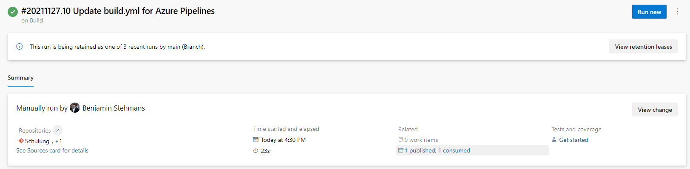
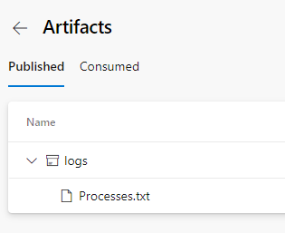

# Veröffentlichen von Artefakten

Artefakte, die während eines Builds entstehen, wollen ja auch irgendwann veröffentlicht werden. Dazu gibt es einen Task, welcher es erlaubt die Artefakte in der Pipeline bereitzustellen.

Zum veröffentlichen von Artefakten verwenden wir den [PublishPipelineArtifact@1](https://docs.microsoft.com/en-us/azure/devops/pipelines/tasks/utility/publish-pipeline-artifact?view=azure-devops) Task. 

## Pipeline umbau
Ändert die **Build Pipeline** wie folgt:

### hinzufügen
```yaml
- task: PublishPipelineArtifact@1
  displayName: Publish Pipeline Artifact
  inputs:
    targetPath: $(Build.ArtifactStagingDirectory)
    artifactName: logs
```

### build.yml

```yaml
resources:
 repositories:
   - repository: code
     type: git
     name: code

trigger: none

pool:
  vmImage: windows-latest

steps:
- checkout: self
  path: schulung
- checkout: code
  path: code

- task: PowerShell@2
  displayName: Print Variable
  inputs:
    targetType: inline
    script: |
      echo $(Pipeline.Workspace)
      echo $(Agent.BuildDirectory)

- task: PowerShell@2
  displayName: Print Tree Path
  inputs:
    targetType: inline
    script: |
      tree $(Pipeline.Workspace) /a

- task: PowerShell@2
  displayName: Export Logs
  inputs:
    targetType: inline
    script: |
      $(Pipeline.Workspace)/code/scripts/Publish-Processes.ps1 -Name "Processes.txt" -Path $(Build.ArtifactStagingDirectory)

- task: PublishPipelineArtifact@1
  displayName: Publish Pipeline Artifact
  inputs:
    targetPath: $(Build.ArtifactStagingDirectory)
    artifactName: logs
```
## Published artifacts
Eure Veröffentlichen Artifakte findet ihr in dem Pipeline lauf.





## Links

[PublishPipelineArtifact@1](https://docs.microsoft.com/en-us/azure/devops/pipelines/tasks/utility/publish-pipeline-artifact?view=azure-devops)  