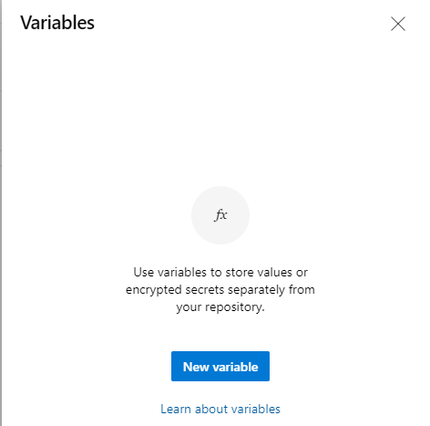
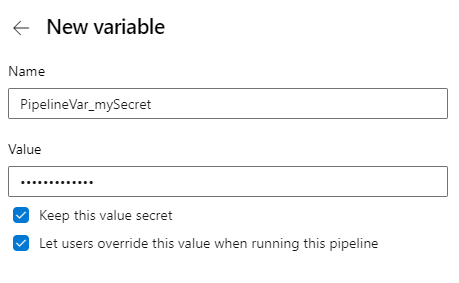
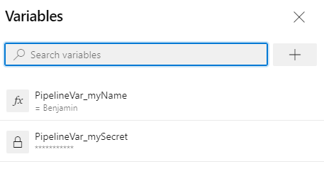
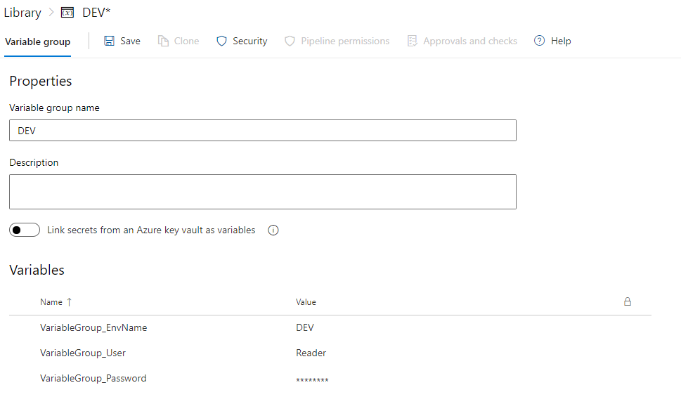
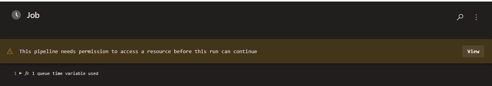
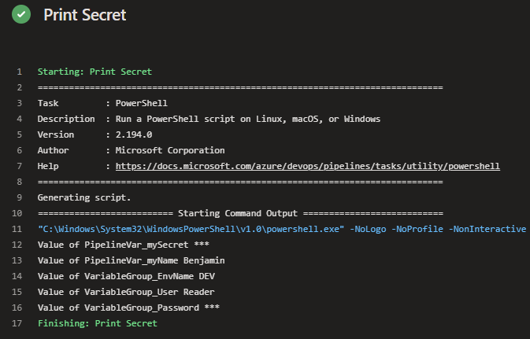

# Variablen und Secrets

Variablen stellen eine bequeme Möglichkeit dar, wichtige Informationen in verschiedene Teile der Pipeline zu übernehmen. Die gängigste Verwendung von Variablen besteht darin, einen Wert zu definieren, welchen ihr dann in eurer Pipeline verwenden könnt. Alle Variablen werden als Zeichenfolgen gespeichert und können veränderlich sein. 

Einschränkungen bei der Benennung von Variablen:  
- können Buchstaben und Zahlen enthalten  
- **.** **(Punkt)** und **_** **(Unterstrich)** können verwendet werden  

Präfixe die vom System reserviert sind dürfen nicht verwendet werden:   
- Endpoint  
- Input  
- Secret  
- Securefile  

Jede Variable, die mit einer dieser Zeichenfolgen beginnt (unabhängig von der Großschreibung), ist für die Aufgaben und Skripte nicht verfügbar.

Außerdem kann es zu Probleme kommen, wenn **Betriebssystem spezifische Variablen** verwendet werden.  
```PATH``` bei Windows


## Variablen im YAML
Es ist möglich Variablen im YAML zu definieren.
```yaml
variables : 
- name: MainVersion
  value: 1
- name: MinorVersion
  value: 2

- script: | 
    echo $(MainVersion)
    echo $(MinorVersion)
  displayName: Print Variables
```

## Verwendung von Variablen
Syntax | Beispiel| Wann wird er verarbeitet?| Wo wird sie in einer Pipelinedefinition erweitert? | Wie wird es gerendert, wenn es nicht gefunden wird?
---|---|---|---|---
Makro|```$(var)```|Runtime, bevor ein Task ausgeführt wird|value (rechte Seite)|	Druckt ```$(var)```
Vorlagenausdruck|```${{variables.var}}```|Kompilierzeit|Schlüssel oder Wert (links oder rechts)|Leere Zeichenfolge
Laufzeitausdruck|```$[variables.var]```|Laufzeit|value (rechte Seite)|Leere Zeichenfolge

## Welche Syntax sollte ich verwenden?
Verwende die Makrosyntax, wenn Sie Eingaben für eine Aufgabe bereitstellen.  

Wähle einen einen Laufzeitausdruck aus, wenn du mit Bedingungen und Ausdrückenarbeitest. Die Ausnahme ist, wenn eine Pipeline verfügbar ist, in der das Drucken ihrer leeren Variablen zu einem Problem führt. Beispiel: Du verfügst über eine bedingte Logik, die auf einer Variablen basiert, die über einen bestimmten Wert oder keinen Wert verfügt. In diesem Fall solltest du einen Laufzeitausdruck verwenden.

Wenn du eine Variable in einer Vorlage definierst, dann verwende  einen Vorlagenausdruck.


## Secrets


### Best Practice - Secrets
*Es gibt nur eine Regel für Secrets:*  
**Setze keine Secrets in der YAML-Datei**

Betriebssysteme protokollieren oft Befehle für die Prozesse, die ausgeführt werden, und man möchte nicht, dass das Protokoll ein Secret enthält. 

## Variablengruppen

Variablengruppen speichern Werte und Geheimnisse, die möglicherweise an eine YAML-Pipeline übergeben oder über mehrere Pipelines hinweg zur Verfügung gestellt werden sollen. Variablengruppen können in mehreren Pipelines im selben Projekt freigeben und verwenden. **Variablengruppen sind geschützte Ressourcen.**

## Wo legen wir Varablen und Secrets an

Wenn es geht halten wir uns an folgenden Vorschlag:   
⛔  **Verbot** von Secrets im YAML  
🛑  Vermeidung von Variablen im YAML   
✅  Verwendung von Variablen und Secrets an der Pipeline  
✅  Verwendung von Variablen und Secrets in der Variablengruppen  
✅  Verwendung eines KeyVaults für Variablen und Secrets


### Verwendung von Variablen und Secrets an der Pipeline  
Folgt den Schritten um die Variablen an der Pipeline anzulegen:  
1. Editiert eure Pipeline  
2. Klickt **Variables**    
    
3. Klickt **New Variable**    
4. Legt die Variablen aus der Tabelle an    
    
5. Klickt **Save**    
    


Name | Value | Keep this value secret | Let users override this value when running this pipeline | Usage
---|---|---|---|--- 
PipelineVar_mySecret|mySecretValue|true|true| $(PipelineVar_mySecret)
PipelineVar_myName|Benjamin|false|true| $(PipelineVar_myName)


### Verwendung von Variablen und Secrets in der Variablengruppen
Legt bitte eine Variable Gruppe mit dem Namen DEV an.  
Geht dazu wie folgt vor:   
1. Öffnet **Library** in Azure DevOps Pipelines  
2. **+ Variable Group**  
3. Vergebt den *Variable group name* : **DEV**  
4. Fügt die Folgenden werte hinzu  
5. Klickt **Save**  

Name | Value | Keep this value secret | Usage
---|---|---|---
VariableGroup_EnvName|DEV|false|$(VariableGroup_EnvName)
VariableGroup_User|Reader|false|$(VariableGroup_User)
VariableGroup_Password|ORAYLIS123|true|$(VariableGroup_Password)
 

## Pipeline umbau
Ändert die **Build Pipeline** wie folgt:

### ➕ hinzufügen
```yaml
variables:
- group: DEV
```

```yaml
- task: PowerShell@2
  displayName: Print Secret
  enabled: true
  inputs:
    targetType: inline
    script: |
      Write-Host "Value of PipelineVar_mySecret $(PipelineVar_mySecret)"
      Write-Host "Value of PipelineVar_myName $(PipelineVar_myName)"
      Write-Host "Value of VariableGroup_EnvName $(VariableGroup_EnvName)"
      Write-Host "Value of VariableGroup_User $(VariableGroup_User)"
      Write-Host "Value of VariableGroup_Password $(VariableGroup_Password)"
```

### build.yml
```yaml
resources:
 repositories:
   - repository: code
     type: git
     name: code

variables:
- group: DEV

trigger: none

pool:
  vmImage: windows-latest

steps:
- checkout: self
  path: schulung
- checkout: code
  path: code

- task: PowerShell@2
  displayName: Print Variable
  inputs:
    targetType: inline
    script: |
      echo $(Pipeline.Workspace)
      echo $(Agent.BuildDirectory)

- task: PowerShell@2
  displayName: Print Tree Path
  inputs:
    targetType: inline
    script: |
      tree $(Pipeline.Workspace) /a

- task: PowerShell@2
  displayName: Export Logs
  inputs:
    targetType: inline
    script: |
      $(Pipeline.Workspace)/code/scripts/Publish-Processes.ps1 -Name "Processes.txt" -Path $(Build.ArtifactStagingDirectory)

- task: PublishPipelineArtifact@1
  displayName: Publish Pipeline Artifact
  inputs:
    targetPath: $(Build.ArtifactStagingDirectory)
    artifactName: logs

- task: PowerShell@2
  displayName: Print Secret
  enabled: true
  inputs:
    targetType: inline
    script: |
      Write-Host "Value of PipelineVar_mySecret $(PipelineVar_mySecret)"
      Write-Host "Value of PipelineVar_myName $(PipelineVar_myName)"
      Write-Host "Value of VariableGroup_EnvName $(VariableGroup_EnvName)"
      Write-Host "Value of VariableGroup_User $(VariableGroup_User)"
      Write-Host "Value of VariableGroup_Password $(VariableGroup_Password)"
```

## Pipeline Run
Damit die Pipeline auf die Variablengruppe zugreifen kann, ist ein Permit notwendig



## Links
[Define variables - Azure Pipelines | Microsoft Docs
](https://docs.microsoft.com/en-us/azure/devops/pipelines/process/variables?view=azure-devops&tabs=yaml%2Cbatch)  
[Secret Variables - Azure Pipelines | Microsoft Docs](https://docs.microsoft.com/en-us/azure/devops/pipelines/process/variables?view=azure-devops&tabs=yaml%2Cbatch#secret-variables)   
[Variable groups for Azure Pipelines - Azure Pipelines | Microsoft Docs
](https://docs.microsoft.com/en-us/azure/devops/pipelines/library/variable-groups?view=azure-devops&tabs=yaml)  
[How to Use Key Vault Secrets in Azure Pipelines | by David Olivas | Geek Culture | Medium](https://medium.com/geekculture/how-to-use-key-vault-secrets-in-azure-pipelines-658198f2eea6)
