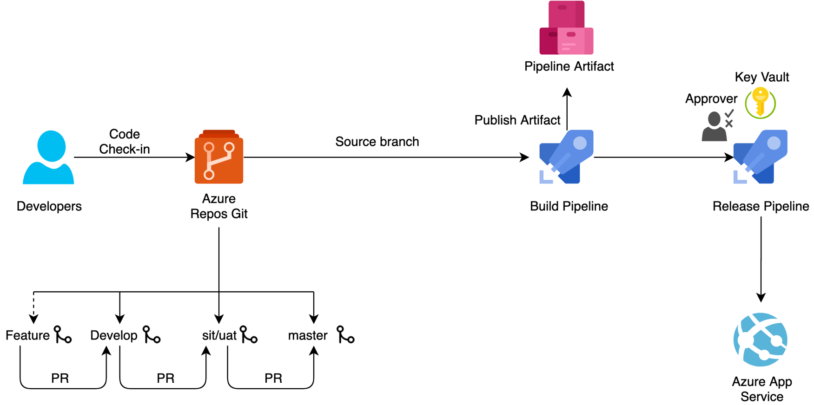
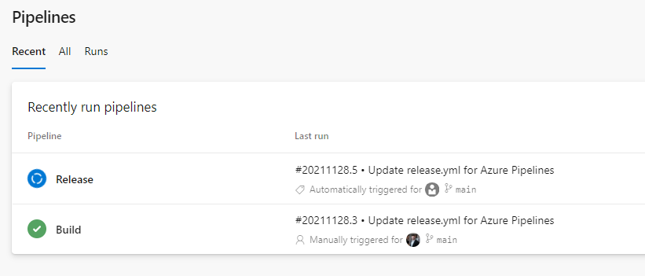

# Trigger



Es gibt vier verschiedene Trigger:   
1. Push - Ein Commit in eine Definierte Branch löst den Pipeline Run aus  
2. Pull Request - Ein Pull Request in eine Definierte Branch löst die Pipeline aus  
**Nur mit GitHub and Bitbucket**  
3. Schedule - Löst eine Pipeline zu einem bestimmten Zeitpunkt aus  
4. Pipeline - Ein erfolgreicher Pipeline lauf löst eine andere Pipeline aus


## Push 
### List syntax
```yaml
trigger: [ string ] # list of branch names
```
```yaml
trigger:
- main
- develop
```
### Disablement syntax
```yaml
trigger: none # will disable CI builds entirely
```
### Full syntax
```yaml
trigger:
  batch: boolean # batch changes if true; start a new build for every push if false (default)
  branches:
    include: [ string ] # branch names which will trigger a build
    exclude: [ string ] # branch names which will not
  tags:
    include: [ string ] # tag names which will trigger a build
    exclude: [ string ] # tag names which will not
  paths:
    include: [ string ] # file paths which must match to trigger a build
    exclude: [ string ] # file paths which will not trigger a build
```
```yaml
trigger:
  batch: true
  branches:
    include:
    - features/*
    exclude:
    - features/experimental/*
  paths:
    exclude:
    - README.md

```


## Pull Request 
### List syntax
```yaml
pr: [ string ] # list of branch names
```
```yaml
pr:
- main
- develop
```
### Disablement syntax
```yaml
pr: none # will disable PR builds entirely; will not disable CI triggers
```
### Full syntax
```yaml
pr:
  autoCancel: boolean # indicates whether additional pushes to a PR should cancel in-progress runs for the same PR. Defaults to true
  branches:
    include: [ string ] # branch names which will trigger a build
    exclude: [ string ] # branch names which will not
  paths:
    include: [ string ] # file paths which must match to trigger a build
    exclude: [ string ] # file paths which will not trigger a build
  drafts: boolean # For GitHub only, whether to build draft PRs, defaults to true
```
```yaml
pr:
  branches:
    include:
    - features/*
    exclude:
    - features/experimental/*
  paths:
    exclude:
    - README.md
```


## Scheduled
### Full syntax
```yaml
schedules:
- cron: string # cron syntax defining a schedule in UTC time
  displayName: string # friendly name given to a specific schedule
  branches:
    include: [ string ] # which branches the schedule applies to
    exclude: [ string ] # which branches to exclude from the schedule
  always: boolean # whether to always run the pipeline or only if there have been source code changes since the last successful scheduled run. The default is false.
```
```yaml
schedules:
- cron: "0 0 * * *"
  displayName: Daily midnight build
  branches:
    include:
    - main
    - releases/*
    exclude:
    - releases/ancient/*
- cron: "0 12 * * 0"
  displayName: Weekly Sunday build
  branches:
    include:
    - releases/*
  always: true
```


## Pipeline
### Full syntax
```yaml
resources:
  pipelines:
  - pipeline: string  # identifier for the resource used in pipeline resource variables
    project: string # project for the source; optional for current project
    source: string  # name of the pipeline that produces an artifact
    version: string  # the pipeline run number to pick the artifact, defaults to latest pipeline successful across all stages; Used only for manual or scheduled triggers
    branch: string  # branch to pick the artifact, optional; defaults to all branches; Used only for manual or scheduled triggers
    tags: [ string ] # list of tags required on the pipeline to pickup default artifacts, optional; Used only for manual or scheduled triggers
    trigger:     # triggers are not enabled by default unless you add trigger section to the resource
      branches:  # branch conditions to filter the events, optional; Defaults to all branches.
        include: [ string ]  # branches to consider the trigger events, optional; Defaults to all branches.
        exclude: [ string ]  # branches to discard the trigger events, optional; Defaults to none.
      tags: [ string ]  # list of tags to evaluate for trigger event, optional; 2020.1 and greater
      stages: [ string ] # list of stages to evaluate for trigger event, optional; 2020.1 and greater
```
```yaml
resources:
  pipelines:
  - pipeline: Build
    source: Schulung
    trigger:
      branches:
        include:
        - main
        - releases/*
        exclude:
        - users/*
```

## Pipeline Erstellen

1. Klickt auf Pipelines    
2. Create Pipeline   
3. Wählt Azure Repos Git   
4. Wählt Schulung   
5. Wählt Starter Pipeline  
6. Ändert den Namen in **release.yml** 

## Pipeline umbau
### ändern
```yaml
trigger: none
```
### hinzufügen 
```yaml
resources:
 pipelines:
   - pipeline: build
     project: Schulung
     source: build
     branch: main
     trigger:
      branches:
         include:
           - main
```
### entfernen
```yaml
# Starter pipeline
# Start with a minimal pipeline that you can customize to build and deploy your code.
# Add steps that build, run tests, deploy, and more:
# https://aka.ms/yaml
```
```yaml
- script: |
    echo Add other tasks to build, test, and deploy your project.
    echo See https://aka.ms/yaml
  displayName: 'Run a multi-line script'
```
### release.yml
```yaml
resources:
 pipelines:
   - pipeline: build
     project: Schulung
     source: build
     branch: main
     trigger:
      branches:
         include:
           - main

trigger: none

pool:
  vmImage: windows-latest

steps:
- script: echo Hello, world!
  displayName: 'Run a one-line script'
```

## Pipeline umbenennen

Damit wir der Pipeline den Namen Release geben können, geht bitte wie folgt vor:  
1. Klickt auf das ⁝ Menü
2. Wählt im Menü *Rename/move*   
3. Ändert den namen in **Release** 

##  Pipeline Ausführung Triggert eine andere Pipeline 



## Links
[Triggers - Azure Pipelines | Microsoft Docs](https://docs.microsoft.com/en-us/azure/devops/pipelines/yaml-schema?view=azure-devops&tabs=schema%2Cparameter-schema#triggers)  
[Configure schedules to run pipelines - Azure Pipelines | Microsoft Docs](https://docs.microsoft.com/en-us/azure/devops/pipelines/process/scheduled-triggers?tabs=yaml&view=azure-devops)  
[Crontab Expression · atifaziz/NCrontab Wiki · GitHub](https://github.com/atifaziz/NCrontab/wiki/Crontab-Expression)  