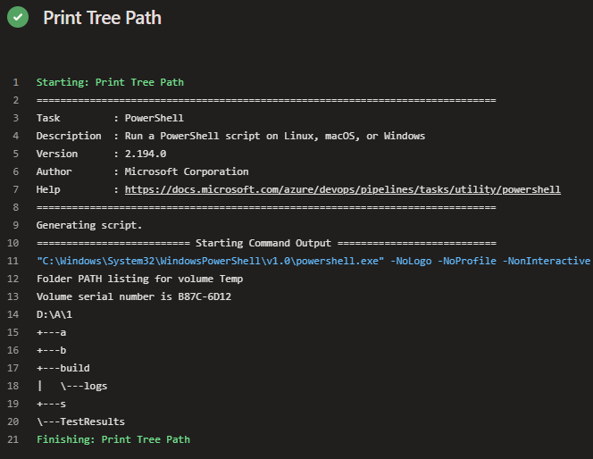

# Artefakte Konsumieren

Damit die Artefakte, welche in der Build Pipeline erstellt wurden, auch in anderen Pipelines verwendet werden können, ist es notwendig diese zu konsumieren. Es gibt verschiedene Möglichkeiten Artefakte zu konsumieren:   
- ```download``` -> Das ```download``` Schlüsselwort lädt Artefakte aus einem Pipeline lauf.  
- ```checkout``` -> Um Quellcode aus einem Repository zu verwenden nutzt man das ```checkout``` Schlüsselwort.  

## Pipeline umbau 

### hinzufügen 
```yaml
- download: build
```
```yaml
- task: PowerShell@2
  displayName: Print Tree Path
  inputs:
    targetType: inline
    script: |
      tree $(Pipeline.Workspace) /a
```
### entfernen
```yaml
- script: echo Hello, world!
  displayName: 'Run a one-line script'
```
### release.yml
```yaml
resources:
 pipelines:
   - pipeline: build
     project: Schulung
     source: build
     branch: main
     trigger:
      branches:
         include:
           - main

trigger: none

pool:
  vmImage: windows-latest

steps:
- download: build

- task: PowerShell@2
  displayName: Print Tree Path
  inputs:
    targetType: inline
    script: |
      tree $(Pipeline.Workspace) /a
```

## Artefakte auf dem Agent

