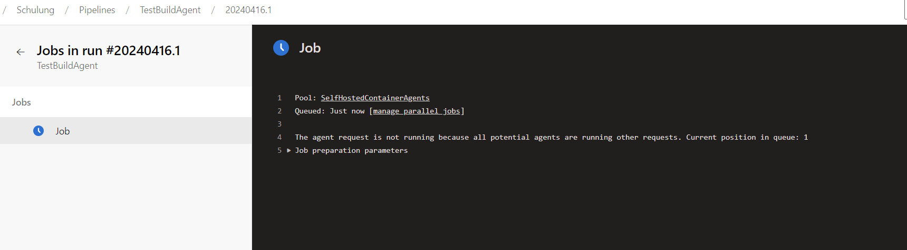
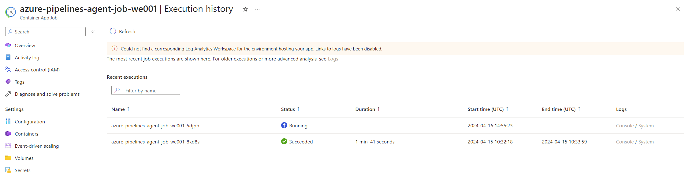

# Selbstgehostete CI CD Agents


## Einleitung

In unserer schnelllebigen IT-Landschaft, wo Effizienz und Kostenoptimierung an oberster Stelle stehen, haben viele Entwickler, die Herausforderung, eine flexible und kosteneffiziente Infrastruktur für Entwicklungs- und Betriebsprozesse zu schaffen. 

Ein spezifisches Beispiel für diese Herausforderung ist der Einsatz von Azure Databricks in isolierten Umgebungen. Hier scheint die konventionelle Lösung oft darin zu bestehen, einen selbstgehosteten Agenten zu nutzen. Diese Methode kann jedoch schnell zu erhöhten Kosten führen, vor allem, wenn eine virtuelle Maschine (VM) dauerhaft betrieben wird. Nicht zu vergessen sind die Aufwände für das Patchmanagement des Betriebssystems.
Zudem kann die Notwendigkeit, eine VM kontinuierlich laufen zu lassen, in vielen unserer Projekte der Strategie, sich auf PaaS-Lösungen zu stützen, entgegenwirken.

Stell dir nun vor, es gäbe eine Lösung, die nicht nur die Kosten minimiert, indem sie Ressourcen nur bei Bedarf verbraucht, sondern auch das zeitaufwendige Management des Betriebssystems überflüssig macht, während der PaaS-Ansatz beibehalten wird. Die Verwendung selbstgehosteter CI/CD-Agents in Kombination mit Azure Container Apps bietet genau diese Vorteile. Diese Lösung ermöglicht es, dass Kosten nur dann anfallen, wenn Deployments ausgeführt werden, und eliminiert gleichzeitig die Notwendigkeit für das Patchen des Betriebssystems.

In diesem Leitfaden werde ich dir zeigen, wie du diese Lösung effektiv implementieren kannst, um deine Entwicklungs- und Bereitstellungsprozesse zu optimieren.

## Azure DevOps mit selbst gehosteten Agenten einrichten

Diese Anleitung führt durch die Einrichtung in einer Azure-Umgebung, die Erstellung von Agentpools in Azure DevOps, die Generierung von Azure DevOps-Zugriffstokens und die Konfiguration der notwendigen Variablen in einer `BuildEnvironment.yml`-Datei.

### Voraussetzungen

Stellen sicher, dass die folgende Voraussetzungen erfüllt sind:

- Azure Umgebung
- Azure DevOps Instanz
- Agentpools
- Azure DevOps-Zugriffstokens
- Variablen im `BuildEnvironment.yml`

#### Azure Umgebung

Erstelle ein [kostenloses Azure-Konto](https://azure.microsoft.com/de-de/free/) wenn keins vorhanden ist.

#### Azure DevOps Instanz

Erstelle eine [kostenlose Azure-DevOps Instanz](https://azure.microsoft.com/de-de/free/devops/) wenn keine vorhanden ist.

##### Zugriffstoken

1. `todo_ORGANIZATION_URL` -> die URL des Azure DevOps Projekts (`https://dev.azure.com/ProjektName`)
2. `todo_AZP_TOKEN` -> persönliches Zugriffstoken (PAT)

Um ein PAT zu erstellen:

1. Wähle in Azure DevOps die Benutzereinstellungen neben Ihrem Profilbild in der oberen rechten Ecke aus.
2. Wähle "Personal Access Tokens" aus.
3. Wähle auf der Seite "Persönliche Zugriffstoken" "Neues Token" aus und gebe die folgenden Werte ein:

| Einstellung| Wert|
| --- | --- |
| Name| Gib einen Namen für den Token an. |
| Organisation| Wähle die Organisation aus. |
| Bereiche| Wähle **Benutzerdefiniert** aus. |
| Alle Bereiche anzeigen | Wähle  **Alle Bereiche anzeigen** aus. |
| Agentpools (Lesen und Verwalten) | Wähle Agentpools (Lesen und Verwalten) aus. |

4. Klicke auf Erstellen und kopiereden Tokenwert an einen sicheren Speicherort.

##### Agentpools

1. Erweiter im Azure DevOps-Projekt die linke Navigationsleiste und wähle "Projekteinstellungen" aus.
2. Wähle unter dem Abschnitt "Pipelines" die Option "Agentpools" aus.
3. Wähle "Pool hinzufügen" aus und gebe folgende Werte ein:

| Einstellung| Wert|
| -- | -- |
| Pool, der verknüpft werden soll| Wähle **Neu** aus.|
| Pooltyp| Wähle **selbst gehostet** aus. |
| Name| Gebe  **SelfHostedContainerAgents** ein. |
| Gewähren der Zugriffsberechtigung für alle Pipelines | Aktiviere dieses Kontrollkästchen. |

##### ServiceConnection
1. Erstellen einer App-Registration und anlegen eines Client Secrets. [Registrierung einer App Registration](https://learn.microsoft.com/en-us/entra/identity-platform/quickstart-register-app)  
1. Vergeben von Contributor Rechten auf der Ressourcengruppe oder Subscription.  
1. App Registration als Service Connection in Azure DevOps anlegen. [Service Connection Anlegen](https://learn.microsoft.com/de-de/azure/devops/pipelines/library/service-endpoints?view=azure-devops&tabs=yaml)  

#### Variablen im BuildEnvironment.yml

Ersetze die `todo_` Werte mit den entsprechenden Informationen in Ihrer `BuildEnvironment.yml`-Datei.

Hier sind die überarbeiteten Tabelleninformationen, wobei die 'todo_' Platzhalter, sofern möglich, entfernt und die Formulierungen vereinheitlicht wurden. Ich habe auch einige grammatische Anpassungen vorgenommen und versucht, die Einheitlichkeit in der Darstellung zu verbessern:

| Name | Wert | Erklärung | Beispiel | 
| --- | --- | --- | --- |
| LOCATION | Zu definieren | Die Azure Region, in der die Containerlösung betrieben werden soll. | westeurope |
| RESOURCEGROUP | Zu definieren | Die Ressourcengruppe, in der die Lösung deployt wird. | shared |
| CONTAINERREGISTRYNAME | Zu definieren | Der eindeutige Name der Container Registry, die eingerichtet werden soll. | cragentwe001 |
| ENVIRONMENT | Zu definieren | Das zu erstellende Environment. Name muss eindeutig sein. | caeagentwe001 |
| JOBNAME | azure-pipelines-agent-job-we001 | Der Anzeigename des Container-Jobs. | azure-pipelines-agent-job-we001 |
| PLACEHOLDERJOBNAME | placeholder-agent-job-we001 | Der Anzeigename des Platzhalter-Jobs. | placeholder-agent-job-we001 |
| CONTAINERIMAGENAME | azure-pipelines-agent:1.0.$(Build.BuildId) | Der Name des in der Container Registry gebauten Images. | azure-pipelines-agent:1.0.$(Build.BuildId) |
| USESUBNET | false | Steuert die Netzwerkeinstellung; `false` für öffentlich, `true` für netzwerkisoliert. | false |
| INFRASTRUCTURESUBNETID | Zu definieren | Die Azure Netzwerk-ID, in die die Containerlösung integriert wird. | /subscriptions/<tbd_subscription_id>/resourceGroups/<tbd_resourceGroupName>/providers/Microsoft.Network/virtualNetworks/<tbd_virtualNetworkName>/subnets/<tbd_subnetName> |
| INTERNALROUTING | true | Gibt an, dass die Umgebung nur über einen internen Load Balancer verfügt und keine öffentliche statische IP-Ressource besitzt. Muss `INFRASTRUCTURESUBNETID` angeben, wenn aktiviert. | true |
| ORGANIZATIONURL | Zu definieren | Die URL der Azure DevOps Organisation, in der die Agents eingerichtet werden. | https://dev.azure.com/<Organisation> |
| AZPPOOL | SelfHostedContainerAgents | Der Name des Agentpools. | SelfHostedContainerAgents |
| isImageBuild | Pipeline Variable | Gibt an, ob es sich um ein Initial-Setup (`false`) oder um den Bau einer neuen Image-Version (`true`) handelt. | An der Pipeline zu definieren |
| ServiceConnection | Zu definieren | Die eingerichtete Service-Connection in Azure DevOps. Kommt mehrfach vor. | ServiceConnection_Name |

#### Neues Azure DevOps Repo erstellen
Erstelle ein neues Azure DevOps Repo.
Klone das Repo lokal und lege folgende Struktur an:
```
Repo
│
└───agent
    │   Dockerfile
    │   BuildEnvironment.yml
    │   TestAgent.yml
    └───azure-pipeline-agent
            start.sh
```
Füge die Inhalte wie beschrieben in die Dateien ein.

Die Files sollten folgende Inhalte haben:


**agent\azure-pipeline-agent\start.sh**
```sh
#!/bin/bash
set -e

if [ -z "$AZP_URL" ]; then
  echo 1>&2 "error: missing AZP_URL environment variable"
  exit 1
fi

if [ -z "$AZP_TOKEN_FILE" ]; then
  if [ -z "$AZP_TOKEN" ]; then
    echo 1>&2 "error: missing AZP_TOKEN environment variable"
    exit 1
  fi

  AZP_TOKEN_FILE=/azp/.token
  echo -n $AZP_TOKEN > "$AZP_TOKEN_FILE"
fi

unset AZP_TOKEN

if [ -n "$AZP_WORK" ]; then
  mkdir -p "$AZP_WORK"
fi

export AGENT_ALLOW_RUNASROOT="1"

cleanup() {
  # If $AZP_PLACEHOLDER is set, skip cleanup
  if [ -n "$AZP_PLACEHOLDER" ]; then
    echo 'Running in placeholder mode, skipping cleanup'
    return
  fi
  if [ -e config.sh ]; then
    print_header "Cleanup. Removing Azure Pipelines agent..."

    # If the agent has some running jobs, the configuration removal process will fail.
    # So, give it some time to finish the job.
    while true; do
      ./config.sh remove --unattended --auth PAT --token $(cat "$AZP_TOKEN_FILE") && break

      echo "Retrying in 30 seconds..."
      sleep 30
    done
  fi
}

print_header() {
  lightcyan='\033[1;36m'
  nocolor='\033[0m'
  echo -e "${lightcyan}$1${nocolor}"
}

# Let the agent ignore the token env variables
export VSO_AGENT_IGNORE=AZP_TOKEN,AZP_TOKEN_FILE

print_header "1. Determining matching Azure Pipelines agent..."

AZP_AGENT_PACKAGES=$(curl -LsS \
    -u user:$(cat "$AZP_TOKEN_FILE") \
    -H 'Accept:application/json;' \
    "$AZP_URL/_apis/distributedtask/packages/agent?platform=$TARGETARCH&top=1")

AZP_AGENT_PACKAGE_LATEST_URL=$(echo "$AZP_AGENT_PACKAGES" | jq -r '.value[0].downloadUrl')

if [ -z "$AZP_AGENT_PACKAGE_LATEST_URL" -o "$AZP_AGENT_PACKAGE_LATEST_URL" == "null" ]; then
  echo 1>&2 "error: could not determine a matching Azure Pipelines agent"
  echo 1>&2 "check that account '$AZP_URL' is correct and the token is valid for that account"
  exit 1
fi

print_header "2. Downloading and extracting Azure Pipelines agent..."
echo "Agent package URL: $AZP_AGENT_PACKAGE_LATEST_URL"
curl -LsS $AZP_AGENT_PACKAGE_LATEST_URL | tar -xz & wait $!

source ./env.sh

trap 'cleanup; exit 0' EXIT
trap 'cleanup; exit 130' INT
trap 'cleanup; exit 143' TERM

print_header "3. Configuring Azure Pipelines agent..."

./config.sh --unattended \
  --agent "${AZP_AGENT_NAME:-$(hostname)}" \
  --url "$AZP_URL" \
  --auth PAT \
  --token $(cat "$AZP_TOKEN_FILE") \
  --pool "${AZP_POOL:-Default}" \
  --work "${AZP_WORK:-_work}" \
  --replace \
  --acceptTeeEula & wait $!

print_header "4. Running Azure Pipelines agent..."

trap 'cleanup; exit 0' EXIT
trap 'cleanup; exit 130' INT
trap 'cleanup; exit 143' TERM

chmod +x ./run.sh


# If $AZP_PLACEHOLDER is set, skipping running the agent
if [ -n "$AZP_PLACEHOLDER" ]; then
  echo 'Running in placeholder mode, skipping running the agent'
else
  # To be aware of TERM and INT signals call run.sh
  # Running it with the --once flag at the end will shut down the agent after the build is executed
  ./run.sh --once & wait $!
fi
```
> Hinweis: Prüft mittels Visual Studio Code die End of Line Sequens diese muss auf LF stehen **nicht** `CRLF`. Sonst kommt es im weitern zu fehlern.


**agent\Dockerfile**
```Dockerfile
# Stage 1: Build environment
FROM ubuntu:20.04 as builder
RUN DEBIAN_FRONTEND=noninteractive apt-get update
RUN DEBIAN_FRONTEND=noninteractive apt-get upgrade -y

WORKDIR /build

# Avoid user interaction
ENV DEBIAN_FRONTEND=noninteractive

# Install common dependencies
RUN DEBIAN_FRONTEND=noninteractive apt-get install -y -qq --no-install-recommends \
    apt-transport-https \
    apt-utils \
    ca-certificates \
    curl \
    unzip \
    zip \
    iputils-ping \
    lsb-release \
    software-properties-common 

# Can be 'linux-amd64', 'linux-arm64' 
ENV ARCH=linux-amd64

# Databricks CLI
# https://github.com/databricks/cli/releases
ENV DB_VERSION 0.213.0
RUN case "${ARCH}" in \
      "linux-amd64") DB_ARCH=linux_amd64 ;; \
      "linux-arm64") DB_ARCH=linux_arm64 ;; \
    esac \
 && curl -fsSL "https://github.com/databricks/cli/releases/download/v${DB_VERSION}/databricks_cli_${DB_VERSION}_${DB_ARCH}.zip" -o databricks.zip \
 && unzip databricks.zip \
 && rm databricks.zip \
 && chmod +x databricks

# yq
# https://github.com/mikefarah/yq/releases
ENV YQ_VERSION 4.41.1
RUN case "${ARCH}" in \
      "linux-amd64") YQ_ARCH=linux_amd64 ;; \
      "linux-arm64") YQ_ARCH=linux_arm64 ;; \
    esac \
 && curl -fsSL "https://github.com/mikefarah/yq/releases/download/v${YQ_VERSION}/yq_${YQ_ARCH}" -o yq \
 && chmod +x yq

# terraform
# https://github.com/hashicorp/terraform/releases
# https://github.com/hashicorp/terraform/blob/main/CHANGELOG.md
ENV TF_VERSION 1.7.3
RUN case "${ARCH}" in \
      "linux-amd64") TF_ARCH=linux_amd64 ;; \
      "linux-arm64") TF_ARCH=linux_arm64 ;; \
    esac \
 && curl -fsSL "https://releases.hashicorp.com/terraform/${TF_VERSION}/terraform_${TF_VERSION}_${TF_ARCH}.zip" -o terraform.zip \
 && unzip terraform.zip \
 && rm terraform.zip \
 && chmod +x terraform

# terraform-docs
# https://github.com/terraform-docs/terraform-docs/releases
ENV TF_DOCS_VERSION=0.17.0
RUN case "${ARCH}" in \
      "linux-amd64") TF_DOCS_ARCH=linux-amd64 ;; \
      "linux-arm64") TF_DOCS_ARCH=linux-arm64 ;; \
    esac \
 && curl -fsSL https://github.com/terraform-docs/terraform-docs/releases/download/v${TF_DOCS_VERSION}/terraform-docs-v${TF_DOCS_VERSION}-${TF_DOCS_ARCH}.tar.gz | tar -xz terraform-docs \
 && chmod +x terraform-docs

####################################################################################################
# Stage 2: Final image
FROM ubuntu:20.04 as agent-image
RUN DEBIAN_FRONTEND=noninteractive apt-get update
RUN DEBIAN_FRONTEND=noninteractive apt-get upgrade -y

# Set work directory
WORKDIR /azp

# Can be 'linux-x64', 'linux-arm64', 'linux-arm', 'rhel.6-x64'.
ENV TARGETARCH=linux-x64

RUN DEBIAN_FRONTEND=noninteractive apt-get install -y -qq --no-install-recommends \
    apt-transport-https \
    apt-utils \
    ca-certificates \
    iputils-ping \
    lsb-release \
    software-properties-common \    
    curl \
    unzip \
    zip \
    git \ 
    jq \
    python3 \
    python3-pip 

RUN pip3 install --no-cache-dir \
    mkdocs==1.5.3 \
    mkdocs-material==9.5.10 

RUN curl -sL https://aka.ms/InstallAzureCLIDeb | bash

# Copy binaries from builder
COPY --from=builder /build/* /usr/local/bin/

# Copy the start script for Azure pipelines agent and ensure it's executable
COPY azure-pipelines-agent/start.sh .
RUN chmod +x start.sh

ENTRYPOINT ["./start.sh"]
```

**agent\BuildEnvironment.yml**
> Hinweis: Hier müssen die todo_ werte ersetzt werden.
```yml
pool:
  vmImage: ubuntu-latest
  
trigger: none

variables:
## Azure
- name: LOCATION
  value: todo_LOCATION
- name: RESOURCEGROUP
  value: todo_RESOURCEGROUP
- name: CONTAINERREGISTRYNAME
  value: todo_CONTAINERREGISTRYNAME 
- name: ENVIRONMENT
  value: todo_ENVIRONMENT 
- name: JOBNAME
  value: azure-pipelines-agent-job-we001
- name: PLACEHOLDERJOBNAME
  value: placeholder-agent-job-we001
- name: CONTAINERIMAGENAME
  value: azure-pipelines-agent:1.0.$(Build.BuildId)
## Network
## https://learn.microsoft.com/en-us/azure/container-apps/vnet-custom-internal?tabs=bash%2Cazure-cli&pivots=azure-portal
- name: USESUBNET
  value: false
- name: INFRASTRUCTURESUBNETID
  value: tbd  ##/subscriptions/<tbd_subscription_id>/resourceGroups/<tbd_resourceGroupName>/providers/Microsoft.Network/virtualNetworks/<tbd_virtualNetworkName>/subnets/<tbd_subnetName>
- name: INTERNALROUTING
  value: true ## true or false
## DevOps  
- name: ORGANIZATIONURL
  value: todo_ORGANIZATIONURL 
- name: AZPPOOL
  value: SelfHostedContainerAgents
## Control
- name: isImageBuild
  value: $[eq(variables['imageBuild'],'true')]

steps:
- checkout: self
  path: docs
    
- task: AzureCLI@2
  displayName: az containerapp env create || az acr create
  condition: and(succeeded(),eq(variables.isImageBuild,false))
  enabled: true 
  inputs:
    azureSubscription: todo_ServiceConnection
    addSpnToEnvironment: true    
    scriptType: bash
    scriptLocation: inlineScript    
    inlineScript: |
      if [ "$USESUBNET" = "true" ]; then
        echo "##[group]az containerapp env create with network"
          az containerapp env create \
            --name "$ENVIRONMENT" \
            --resource-group "$RESOURCEGROUP" \
            --location "$LOCATION" \
            --infrastructure-subnet-resource-id "$INFRASTRUCTURESUBNETID" \
            --internal-only "$INTERNALROUTING" \
            --logs-destination none
        echo "##[endgroup]"
      else
        echo "##[group]az containerapp env create"
          az containerapp env create \
            --name "$ENVIRONMENT" \
            --resource-group "$RESOURCEGROUP" \
            --location "$LOCATION" \
            --logs-destination none
        echo "##[endgroup]"
      fi
      echo "##[group]az acr create"
        az acr create \
        --name "$CONTAINERREGISTRYNAME" \
        --resource-group "$RESOURCEGROUP" \
        --location "$LOCATION" \
        --sku Basic \
        --admin-enabled true
        echo "##[endgroup]"

- task: AzureCLI@2
  displayName: az acr build
  enabled: true 
  inputs:
    azureSubscription: todo_ServiceConnection
    addSpnToEnvironment: true    
    scriptType: bash
    workingDirectory: $(Pipeline.Workspace)/docs/docker/
    scriptLocation: inlineScript    
    inlineScript: |
      az acr build \
          --registry "$CONTAINERREGISTRYNAME" \
          --resource-group "$RESOURCEGROUP" \
          --image "$CONTAINERIMAGENAME" \
          --file "Dockerfile" \
          .

- task: AzureCLI@2
  displayName: az containerapp job create || az containerapp job start || az containerapp job delete
  condition: and(succeeded(),eq(variables.isImageBuild,false)) 
  enabled: true 
  inputs:
    azureSubscription: todo_ServiceConnection
    addSpnToEnvironment: true    
    scriptType: bash
    scriptLocation: inlineScript    
    inlineScript: |
      echo "##[group]az containerapp job create"
      az containerapp job create -n "$PLACEHOLDERJOBNAME" -g "$RESOURCEGROUP" --environment "$ENVIRONMENT" \
        --trigger-type Manual \
        --replica-timeout 300 \
        --replica-retry-limit 0 \
        --replica-completion-count 1 \
        --parallelism 1 \
        --image "$CONTAINERREGISTRYNAME.azurecr.io/$CONTAINERIMAGENAME" \
        --cpu "2.0" \
        --memory "4Gi" \
        --secrets "personal-access-token=$(AZP_TOKEN)" "organization-url=$ORGANIZATIONURL" \
        --env-vars "AZP_TOKEN=secretref:personal-access-token" "AZP_URL=secretref:organization-url" "AZP_POOL=$AZPPOOL" "AZP_PLACEHOLDER=1" "AZP_AGENT_NAME=placeholder-agent" \
        --registry-server "$CONTAINERREGISTRYNAME.azurecr.io"
      echo "##[endgroup]"
      echo "##[group]az containerapp job start"
      az containerapp job start -n "$PLACEHOLDERJOBNAME" -g "$RESOURCEGROUP"
      sleep 90s
      az containerapp job execution list \
        --name "$PLACEHOLDERJOBNAME" \
        --resource-group "$RESOURCEGROUP" \
        --output table \
        --query '[].{Status: properties.status, Name: name, StartTime: properties.startTime}'
      echo "##[endgroup]"
      echo "##[group]az containerapp job delete"   
      az containerapp job delete -n "$PLACEHOLDERJOBNAME" -g "$RESOURCEGROUP" --yes
      echo "##[endgroup]"

- task: AzureCLI@2
  displayName: az containerapp job create
  enabled: true 
  inputs:
    azureSubscription: todo_ServiceConnection
    addSpnToEnvironment: true    
    scriptType: bash
    scriptLocation: inlineScript    
    inlineScript: |
      az containerapp job create -n "$JOBNAME" -g "$RESOURCEGROUP" --environment "$ENVIRONMENT" \
        --trigger-type Event \
        --replica-timeout 1800 \
        --replica-retry-limit 0 \
        --replica-completion-count 1 \
        --parallelism 1 \
        --image "$CONTAINERREGISTRYNAME.azurecr.io/$CONTAINERIMAGENAME" \
        --min-executions 0 \
        --max-executions 10 \
        --polling-interval 30 \
        --scale-rule-name "azure-pipelines" \
        --scale-rule-type "azure-pipelines" \
        --scale-rule-metadata "poolName=$AZPPOOL" "targetPipelinesQueueLength=1" \
        --scale-rule-auth "personalAccessToken=personal-access-token" "organizationURL=organization-url" \
        --cpu "2.0" \
        --memory "4Gi" \
        --secrets "personal-access-token=$(AZP_TOKEN)" "organization-url=$ORGANIZATIONURL" \
        --env-vars "AZP_TOKEN=secretref:personal-access-token" "AZP_URL=secretref:organization-url" "AZP_POOL=$AZPPOOL" \
        --registry-server "$CONTAINERREGISTRYNAME.azurecr.io"
```

**agent\TestAgent.yml**
```yml
trigger:
- none

pool:
  name: SelfHostedContainerAgents

steps:
- script: |
    sleep 30
  displayName: 'Sleep'
  continueOnError: true
- script: |
    echo "Testing Azure CLI installation..."
    az --version
  displayName: 'Test Azure CLI'
  continueOnError: true
- script: |
    echo "Testing Databricks CLI installation..."
    databricks --version
  displayName: 'Test Databricks CLI'
  continueOnError: true
- script: |
    echo "Testing yq installation..."
    yq --version
  displayName: 'Test yq'
  continueOnError: true
- script: |
    echo "Testing Terraform installation..."
    terraform version
  displayName: 'Test Terraform'
  continueOnError: true
- script: |
    echo "Testing mkdocs installation..."
    mkdocs --version
  displayName: 'Test mkdocs'
  continueOnError: true
- script: |
    echo "Testing mkdocs-material extension..."
    pip3 list | grep mkdocs-material
  displayName: 'Test mkdocs-material'
  continueOnError: true
```

#### Pipelines erstellen
Erstelle zwei Pipelines in Azure DevOps:

1. **BuildEnvironment.yml** für die Pipeline `SetupBuildAgent` im Ordner `Orga`. 
  Füge zwei Variablen hinzu:
    - **imageBuild** mit dem Wert **false**. Wähle die Option (Die Benutzer können diesen Wert bei der Ausführung dieser Pipeline überschreiben.)
    - **AZP_TOKEN** mit dem Wert aus dem Abschnitt **Zugriffstoken** . Wähle die Option (Die Benutzer können diesen Wert bei der Ausführung dieser Pipeline überschreiben.)
2. **TestAgent.yml** für die Pipeline `TestBuildAgent` im Ordner `Orga`.

#### Ausführen der Pipelines
1. Führe die **SetupBuildAgent** Pipeline aus und beobachte, ob alle Ressourcen in der Azure Resource Group angelegt werden.
1. Im Anschluss an die Ausführung der Pipeline **SetupBuildAgent** den Wert **imageBuild** auf `true` stellen.
1. Führe die `TestBuildAgent` Pipeline aus und überprüfe, ob ein selbst gehosteter Agent verwendet wird.

#### Ressourcen Provisionierung


#### Pipeline ausführung

1. **Ausführung der Azure Pipeline:**  
    Die Pipeline wird in Azure DevOps gestartet.
    
    

1. **Start des Container App Jobs:**  
    Der Container App Jobs in Azure gestartet.
    

1. **Registrierung des Agents bei Azure DevOps:**  
    Sobald der Container hochgefahren ist, wird der Agent bei Azure DevOps registriert. Diese Registrierung ermöglicht es dem Agenten, Aufgaben und Befehle von Azure DevOps zu empfangen und auszuführen. 
    

1. **Ausführung der Pipeline auf der Container App:**  
    Nach der Registrierung des Agents beginnt die eigentliche Ausführung der Pipeline im Container. 
    

1. **Deregistrierung des Agents nach der Ausführung:**  
    Nachdem alle Aufgaben ausgeführt wurden, wird der Agent bei Azure DevOps deregistriert. 
    
    


1. **Aufräumen und Abschluss:**  
    Zum Abschluss werden alle Ressourcen, die für den Job genutzt wurden gelöscht. 
    


#### Azure Ressourcen und Image in der Container Registry


## Links
- [Tutorial: Bereitstellen von selbstgehosteten CI/CD-Runnern und -Agents mit Azure Container Apps-Aufträgen](https://learn.microsoft.com/de-de/azure/container-apps/tutorial-ci-cd-runners-jobs?tabs=bash&pivots=container-apps-jobs-self-hosted-ci-cd-azure-pipelines)
