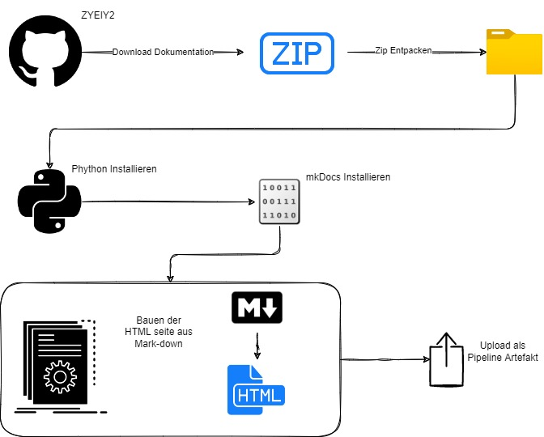
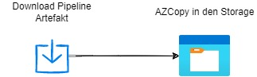
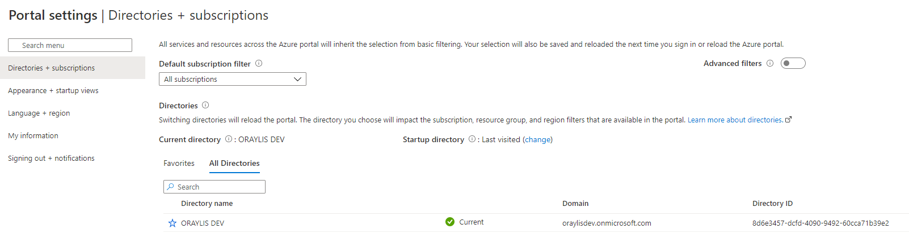
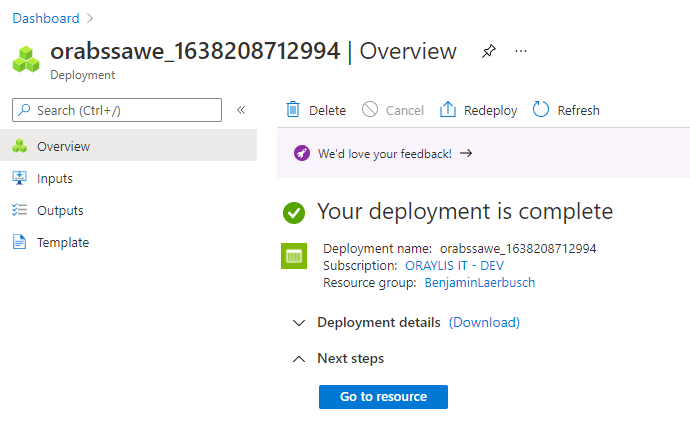
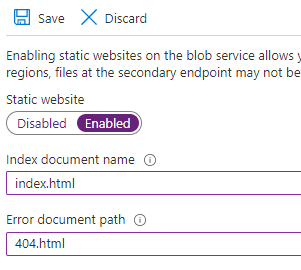

# Praktische aufgabe

Wir wollen mit dem heute gewonnen Wissen diese Dokumentation selbst bauen und als Website auf einem Storage bereitstellen. 

## Build  
    
**Wie läuft der Build ab?**    
- In der **build.yml** Pipeline  
- Das Template **Invoke-Dokumentation.yml** lädt aus dem [GitHub Repository](https://github.com/zyeiy2/Content_Dokumentation) die aktuelle Struktur herunter. Entpackt das .zip File und legt unter dem Pfad ```$(Pipeline.Workspace)/Content_Dokumentation``` die Markdown Files ab.   
- Wir installieren die aktuellste Version von Python auf dem Agent  
- Wir installieren die mkDocs Module  
- Wir führen ein mkDocs Build aus  
- Publish der Artefakte  

---

## Release
  
**Wie läuft das Release ab?**  
- Wir laden die Pipeline Artefakte aus dem Build herunter  
- Wir führen ein AZCopy aus um die Daten vom Build Agent auf den Azure Storage zu bekommen

## Voraussetzung  
### Erstellen eines Azure Storage    
Geht bitte wie folgt vor, um einen Azure Storage im ORAYLIS Tennant zu erstellen:  
1. Login auf [portal.azure.com](https://portal.azure.com/) mit dem ORAYLIS Account  
2. Prüft bitte ob ihr im **ORAYLIS DEV** Directory seid    
- Klickt auf das Zahnrad oben rechts wenn nicht **ORAYLIS DEV** ausgewählt ist dann Klickt auf Switch.
  
3. Klickt **+ Create a resource**  
4. Sucht nach **Storage Account**, wählen und **Create**  
5. Subscription -> ORAYLIS IT - Dev  
6. Resource group -> Euer Name  
7. Storage account name -> orabssawe  
- ora -> ORAYLIS  
- bs -> euer kürzel  
- sa -> Storage Account  
- we -> Region West Europe  
8.  Region -> (Europe) West Europe    
9. Performance ->  Standard  
10. Redundancy -> Locally-redundant storage  
11. Klickt **Review + create**  
12. Klickt **Create**
  
13. Wenn ✅ **Your deployment is complete** dann **Go to resource**  

### Enable Static website  
1. Wählt im Storage Account **Static website**    
2. Stellt auf **Enabled**  
3. Index document name -> index.html  
4. Error document path -> 404.html  
  
5. Speichern  
6. Ruft im Browser den Primary endpoint eures Storage auf  

### SAS Token erstellen  
1. Wählt im Storage Account **Shared access signature**  
2. Klickt **Allowed resource types** Container und Object
3. Klickt **Generate SAS and connection string**
4. Kopiert euch den SAS token

### Checkliste  
Habt ihr folgende werte:  
- Name des Storage Accounts -> orabssawe   
- URL der Static WebSite  
- SAS Token  

## Pipelines Umbauen

### build.yml

#### Resources
Ihr benötigt das **Code** Repository. Denkt an den Checkout.

#### Trigger 
Trigger auf **none**

#### Pool 
Da Ubuntu hier am schnellsten ist, nutzt bitte **ubuntu-latest**.

#### Steps

##### Install latest Python Version
- Task **UsePythonVersion@0**
- Inputs siehe Tabelle  

versionSpec | addToPath | architecture  
---|---|---  
'3.x'| true|'x64'   

##### Install mkDocs and relevant modules
- Task **PowerShell@2**  
- TargetType: 'inline'  
- script   
```PowerShell  
python -m pip install mkdocs --user  
python -m pip install mkdocs-material --user  
python -m pip install mkdocs-glightbox --user
```  

##### Build Site
- Task **PowerShell@2**  
- TargetType: 'inline'  
- workingDirectory: $(Pipeline.Workspace)/Content_Dokumentation  
- script   
```PowerShell  
python -m mkdocs build --clean  
```  

##### Publish Artifact: site
- Task: **PublishBuildArtifacts@1**
- Inputs siehe Tabelle   

artifactName | PathtoPublish
---|---
'site' | $(Pipeline.Workspace)/Content_Dokumentation/site


### release.yml
Variables

Name | Value 
--- | ---
container | **`$web** 
sasToken | **$** + Value of SAS Token
storageAccount | Value of Storage Account Name

#### Resources
Ihr benötigt die **Build** Pipeline. Denkt an den Download.

#### Trigger 
Trigger auf **none**.  
Bitte einen Trigger nach der Build Pipeline.

#### Pool 
Da das AZ Copy am besten auf Windows läuft, nutzt bitte **windows-latest**.

#### Steps

##### Export to Azure Storage
- Task **PowerShell@2**  
- TargetType: 'inline'  
- script   
```PowerShell  
Write-Host "Start delte https://$(storageAccount).blob.core.windows.net/$(container)"
azcopy rm "https://$(storageAccount).blob.core.windows.net/$(container)/$(sasToken)" --recursive=true
Write-Host "Finish delte https://$(storageAccount).blob.core.windows.net/$(container)"
Write-Host "Start upload content https://$(storageAccount).blob.core.windows.net/$(container)"
azcopy copy $(Pipeline.Workspace)/build/site/* "https://$(storageAccount).blob.core.windows.net/$(container)/$(sasToken)" --recursive=true
Write-Host "Finish upload content https://$(storageAccount).blob.core.windows.net/$(container)"
```  


## Links
[MkDocs | Project documentation with Markdown](https://www.mkdocs.org/)    
[Material for MkDocs](https://squidfunk.github.io/mkdocs-material/)  
[Kopieren oder Verschieben von Daten in Azure Storage mit AzCopy v10 | Microsoft Docs ](https://docs.microsoft.com/de-de/azure/storage/common/storage-use-azcopy-v10)    
[PIP | The PyPA recommended tool for installing Python packages](https://pypi.org/project/pip/)