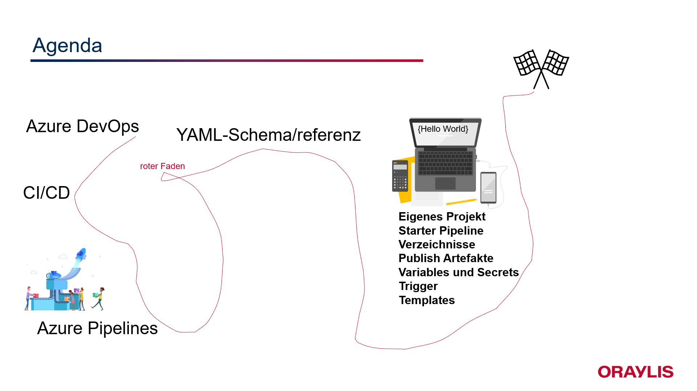

# Agenda
Was werden wir uns heute anschauen: 

**Azure DevOps**  
**CI/CD** 
**Azure Pipelines**  
**YAML-Schema/referenz**  
**Hands-ON**  

## Disclaimer
Jedes **Projekt** und die damit verbundenen Anforderungen sind **unterschiedlich**. Wir können heute keine Standards für alle Deployments finden. Wichtig ist es ein Gefühl für Azure Pipelines zu bekommen und ein erstes begleitetes Hands-On zu erleben. 

