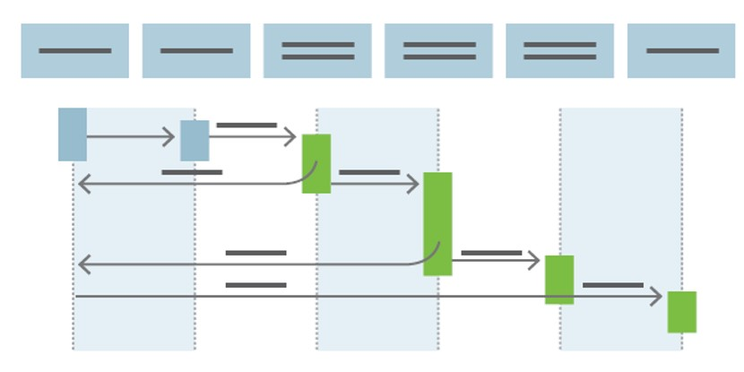

# CI/CD

## Continuous Integration (CI)

Continuous Integration (CI) ist eine Softwareentwicklungspraxis, bei der Entwickler regelmäßig Codeänderungen in einem gemeinsamen Repository integrieren. Das Hauptziel von Continuous Integration ist es, die Integration von Codeänderungen so früh und häufig wie möglich während des Entwicklungsprozesses zu automatisieren. Dies erleichtert die frühzeitige Erkennung von Konflikten und Fehlern im Code.

Die wichtigsten Merkmale von Continuous Integration sind:

1. **Automatisierte Builds:** CI-Systeme automatisieren den Prozess des Zusammenstellens (Build) des Codes, um sicherzustellen, dass die Anwendung ordnungsgemäß kompiliert und ausgeführt werden kann.

2. **Automatisierte Tests:** Neben dem Build-Prozess umfasst CI auch die Ausführung automatisierter Tests, um sicherzustellen, dass die neuen Änderungen keine bestehende Funktionalität beeinträchtigen.

3. **Häufige Integration:** Entwickler integrieren ihren Code häufig (normalerweise mehrmals pro Tag) in das gemeinsame Repository, um sicherzustellen, dass der Codebasis immer stabil bleibt.

4. **Frühe Fehlererkennung:** Durch die automatisierten Builds und Tests können Fehler frühzeitig im Entwicklungsprozess erkannt und behoben werden, was die Qualität des Codes verbessert.

5. **Schnelle Rückmeldung:** CI-Systeme geben den Entwicklern schnell Rückmeldung über den Erfolg oder Misserfolg ihrer Codeintegration, damit Probleme sofort behoben werden können.

6. **Versionskontrolle:** Continuous Integration basiert oft auf einem Versionskontrollsystem wie Git, das die Verfolgung von Codeänderungen erleichtert.

Die Implementierung von Continuous Integration hilft, die Gesamtqualität des Codes zu verbessern, die Time-to-Market zu verkürzen und die Zusammenarbeit im Entwicklerteam zu fördern. Es bildet auch die Grundlage für fortgeschrittenere Praktiken wie Continuous Deployment (CD), bei der Codeänderungen automatisch in die Produktionsumgebung bereitgestellt werden.

## Continuous Deployment (CD)

Continuous Deployment (CD) ist eine Erweiterung der Praxis von Continuous Integration (CI) und bezieht sich auf den automatischen Prozess der Bereitstellung von Softwareänderungen in einer Produktionsumgebung. Während Continuous Integration darauf abzielt, Codeänderungen frühzeitig und häufig zu integrieren, geht Continuous Deployment einen Schritt weiter und automatisiert den Prozess der Auslieferung von Software bis in die Produktionsumgebung.

Die Schlüsselmerkmale von Continuous Deployment sind:

1. **Automatisierte Bereitstellung:** Der gesamte Prozess der Bereitstellung, von der Integration über Tests bis hin zur Auslieferung in die Produktionsumgebung, ist vollständig automatisiert.

2. **Schnelle Iterationen:** Entwickler können schnell und häufig neue Funktionen oder Bugfixes bereitstellen, da der Bereitstellungsprozess automatisch und effizient ist.

3. **Geringe menschliche Eingriffe:** Der manuelle Eingriff in den Bereitstellungsprozess wird minimiert, was das Risiko menschlicher Fehler reduziert.

4. **Echtzeit-Feedback:** Durch die Automatisierung erhalten Entwickler schnell Rückmeldungen darüber, wie ihre Codeänderungen in der Produktionsumgebung funktionieren.

5. **Kontinuierliche Verbesserung:** Da der gesamte Prozess automatisiert ist, können Teams kontinuierlich Verbesserungen vornehmen und schnell auf Kundenfeedback reagieren.

Es ist wichtig zu beachten, dass Continuous Deployment nicht in allen Situationen geeignet ist. In einigen Umgebungen, insbesondere in sicherheitskritischen Branchen oder in Anwendungen, die strengen Compliance-Anforderungen unterliegen, kann Continuous Deployment zu risikoreich sein. In solchen Fällen wird häufig Continuous Delivery (CD) bevorzugt, bei dem der letzte Schritt der Bereitstellung bewusst manuell ausgelöst wird, um eine zusätzliche Kontrolle zu gewährleisten.

Continuous Deployment ist ein integraler Bestandteil von DevOps-Praktiken, da es die Automatisierung und Zusammenarbeit zwischen den Entwicklungsteams und den Betriebsteams fördert.

## Literatur Empfehlung

### The Phoenix Project

"The Phoenix Project" von Gene Kim ist ein Wirtschaftsroman, der sich auf die Prinzipien und Praktiken von DevOps konzentriert. 

Das Buch erzählt die Geschichte von Bill, einem IT-Manager, der unerwartet die Leitung eines wichtigen Projekts namens "The Phoenix Project" übernehmen muss. Das Projekt ist entscheidend für die Zukunft des Unternehmens, aber es steckt in Problemen fest. Das Unternehmen steht vor zahlreichen Herausforderungen, darunter verärgerte Kunden, fehlgeschlagene Projekte, ständige Störungen und einen drohenden Verlust an Wettbewerbsfähigkeit.

Während Bill versucht, die Dinge zu verbessern, trifft er auf Erik, einen erfahrenen IT-Manager, der ihn in die Prinzipien von DevOps einführt. DevOps ist eine Kultur und Reihe von Praktiken, die darauf abzielen, die Zusammenarbeit zwischen Entwicklern und Betriebsteams zu verbessern, die Bereitstellung von Software zu beschleunigen und die Zuverlässigkeit von Systemen zu erhöhen.

Im Verlauf des Buches werden die grundlegenden Prinzipien von DevOps, wie kontinuierliche Integration, kontinuierliche Bereitstellung und Automatisierung, veranschaulicht. Die Geschichte zeigt, wie diese Prinzipien angewendet werden können, um die Effizienz, Qualität und Agilität in einer Organisation zu steigern. Das Buch unterstreicht die Bedeutung von Zusammenarbeit, Kommunikation und dem gemeinsamen Verständnis der Ziele zwischen Entwicklung und Betrieb.

"The Phoenix Project" bietet nicht nur eine fesselnde Geschichte, sondern auch praktische Einsichten und Ratschläge für Führungskräfte und Fachleute, die sich mit den Herausforderungen der modernen Softwareentwicklung und IT-Infrastruktur auseinandersetzen. Es ist ein beliebtes Werk in der DevOps-Gemeinschaft und hat dazu beigetragen, die Prinzipien von DevOps in Unternehmen weltweit zu verbreiten.

### Project Unicorn
  
"The Unicorn Project" von Gene Kim ist ein Roman, der als Fortsetzung seines früheren Werks "The Phoenix Project" gilt. 

Das Buch erzählt die Geschichte von Maxine, auch bekannt als "Max", einer Softwareentwicklerin, die unglücklicherweise in ein Projekt gerät, das als "The Unicorn Project" bezeichnet wird. Dieses Projekt ist darauf ausgerichtet, die IT-Abteilung eines Unternehmens zu revolutionieren und es in die digitale Zukunft zu führen.

Maxine erlebt die Herausforderungen und Frustrationen der modernen Softwareentwicklung, darunter veraltete Systeme, bürokratische Hürden und eine generelle Unfähigkeit, mit den Anforderungen der sich schnell verändernden Geschäftswelt Schritt zu halten. Das Buch hebt die Bedeutung von DevOps-Prinzipien und agilen Methoden hervor, um die Zusammenarbeit zwischen Entwicklung und Betrieb zu verbessern und die Lieferung von Software effizienter zu gestalten.

Während Maxine mit den Schwierigkeiten des Projekts konfrontiert wird, deckt sie wichtige Lektionen über Teamarbeit, Führung und die Bedeutung von Empowerment in der Entwicklergemeinschaft auf. Das Buch betont auch die Bedeutung von Automatisierung, kontinuierlicher Integration und kontinuierlicher Bereitstellung (CI/CD) für den Erfolg moderner Softwareprojekte.

Insgesamt ist "The Unicorn Project" eine fesselnde Erzählung über die Herausforderungen und Triumphmomente in der Welt der Softwareentwicklung und gibt wertvolle Einblicke in bewährte Praktiken für eine erfolgreiche digitale Transformation.

## Links
[Was ist DevOps? - Azure DevOps | Microsoft Docs](https://docs.microsoft.com/de-de/devops/what-is-devops)  