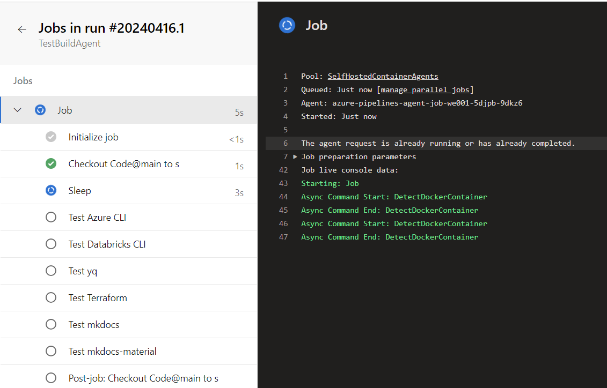
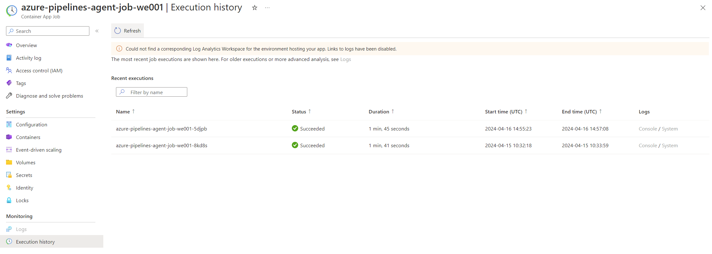

# Azure Resources 

Bevor ein selbstgehosteter Agent in Azure DevOps eine Pipeline ausführen kann, müssen im Hintergrund verschiedene Azure-Ressourcen dynamisch bereitgestellt und orchestriert werden. Dieser Abschnitt zeigt, wie dieser automatisierte Prozess im Detail abläuft – von der Erstellung der Infrastruktur über das Erzeugen und Bereitstellen eines Container-Images bis hin zur Registrierung eines temporären Agents im DevOps Agent Pool. Das folgende Diagramm veranschaulicht die einzelnen Schritte der Provisionierung, die initial durchlaufen werden müssen.

**Ressourcen Provisionierung**
```mermaid
graph TD
  %% Legend 
  subgraph Legend
    direction TB
    L1[DevOps]
    L2[Azure Resource]
    style L1 fill:#107C10,stroke:#0B5C0B,color:#ffffff
    style L2 fill:#0078D7,stroke:#005A9E,color:#ffffff
  end

  %% DevOps Pipeline
  subgraph DevOps Pipeline
    A[Start Pipeline]
    E2[Registrierung Placeholder Agent in Pool]
    G[Fertigstellen Pipeline]
    style A fill:#107C10,stroke:#0B5C0B,color:#ffffff
    style E2 fill:#107C10,stroke:#0B5C0B,color:#ffffff
    style G fill:#107C10,stroke:#0B5C0B,color:#ffffff
  end

  %% Azure Resources
  subgraph Azure
    B[Container-App-Umgebung erstellen]
    B1[Container-App-Umgebung mit VNet erstellen]
    B2[Container-App-Umgebung ohne VNet erstellen]
    C[Azure Container Registry erstellen]
    D[Agent-Image in Container Registry erstellen]
    E[Placeholder-Job erstellen]
    E1[Placeholder-Job starten]
    E3[Placeholder-Job löschen]
    F[Agent-Job erstellen oder aktualisieren] 

    style B fill:#0078D7,stroke:#005A9E,color:#ffffff
    style B1 fill:#0078D7,stroke:#005A9E,color:#ffffff
    style B2 fill:#0078D7,stroke:#005A9E,color:#ffffff
    style C fill:#0078D7,stroke:#005A9E,color:#ffffff
    style D fill:#0078D7,stroke:#005A9E,color:#ffffff
    style E fill:#0078D7,stroke:#005A9E,color:#ffffff
    style E1 fill:#0078D7,stroke:#005A9E,color:#ffffff
    style E3 fill:#0078D7,stroke:#005A9E,color:#ffffff
    style F fill:#0078D7,stroke:#005A9E,color:#ffffff
  end

  %% Flow
  A --> B
  B -->|USESUBNET=true| B1
  B -->|USESUBNET=false| B2
  B1 --> C
  B2 --> C
  C --> |IsImageBuild=true| D 
  D --> E
  E --> E1
  E1 --> E2
  E2 --> E3
  D --> |IsImageBuild=true|F
  E3 -->G 
  F -->G 
```

**Pipeline ausführung**
```mermaid
graph TD
  %% Legend 
  subgraph Legend
    direction TB
    L1[DevOps]
    L2[Azure Resource]
    style L1 fill:#107C10,stroke:#0B5C0B,color:#ffffff
    style L2 fill:#0078D7,stroke:#005A9E,color:#ffffff
  end

  A[Start der DevOps Pipeline] --> B[Start des Container App Jobs]
  B --> C[Registrierung des Agents bei Azure DevOps]
  C --> D[Ausführung der Pipeline]
  D --> E[Deregistrierung des Agents nach der Ausführung]
  E --> F[Stoppen der Container App]

  %% Step Styles
  style A fill:#107C10,stroke:#0B5C0B,color:#ffffff
  style B fill:#0078D7,stroke:#005A9E,color:#ffffff
  style C fill:#107C10,stroke:#0B5C0B,color:#ffffff
  style D fill:#107C10,stroke:#0B5C0B,color:#ffffff
  style E fill:#107C10,stroke:#0B5C0B,color:#ffffff
  style F fill:#0078D7,stroke:#005A9E,color:#ffffff
```

1. **Ausführung der Azure Pipeline**  
    Die Pipeline wird in Azure DevOps gestartet.
    
    

1. **Start des Container App Jobs**  
    Der Container App Jobs in Azure gestartet.
    

1. **Registrierung des Agents bei Azure DevOps**  
    Sobald der Container hochgefahren ist, wird der Agent bei Azure DevOps registriert. Diese Registrierung ermöglicht es dem Agenten, Aufgaben und Befehle von Azure DevOps zu empfangen und auszuführen. 
    

1. **Ausführung der Pipeline auf der Container App**  
    Nach der Registrierung des Agents beginnt die eigentliche Ausführung der Pipeline im Container. 
    

1. **Deregistrierung des Agents nach der Ausführung**  
    Nachdem alle Aufgaben ausgeführt wurden, wird der Agent bei Azure DevOps deregistriert. 
    
    

1. **Aufräumen und Abschluss**  
    Zum Abschluss werden alle Ressourcen, die für den Job genutzt wurden gelöscht. 
    

**Azure Ressourcen und Image in der Container Registry**

**Azure Kosten** 

| Service category | Service type | Region |  Estimated monthly cost in € |
| --- | --- | --- | --- | 
| Containers | Azure Container Registry | West Europe | 5.08€ |
| Containers | Azure Container Apps | West Europe | 48.87€ |

> Hinweis: Bei dieser Rechnung wird davon ausgegangen das es 100 Stunden an Release Aktivitäten kommt in denen der Self Hosted- Agent gebraucht wird. 
Das sind pro Tag 3 Stunden, 20 Minuten Agent Runtime pro Tag. Dies ist ein ausreichender Puffer.