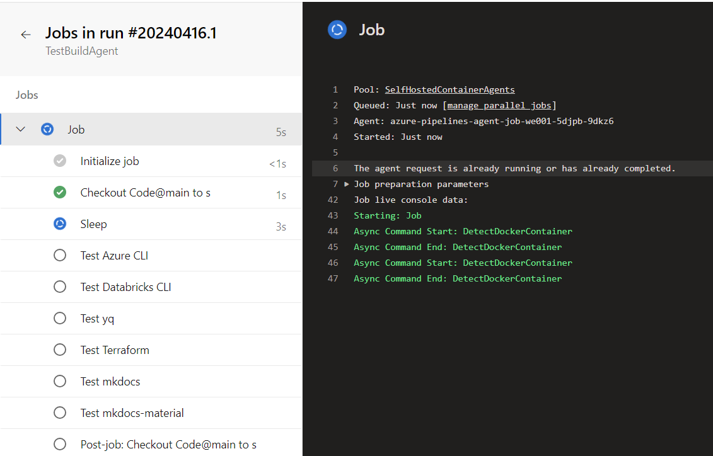

# Azure Resources 

Bevor ein selbstgehosteter Agent in Azure DevOps eine Pipeline ausführen kann, müssen im Hintergrund verschiedene Azure-Ressourcen dynamisch bereitgestellt und orchestriert werden. Dieser Abschnitt zeigt, wie dieser automatisierte Prozess im Detail abläuft – von der Erstellung der Infrastruktur über das Erzeugen und Bereitstellen eines Container-Images bis hin zur Registrierung eines temporären Agents im DevOps Agent Pool. Das folgende Diagramm veranschaulicht die einzelnen Schritte der Provisionierung, die initial durchlaufen werden müssen.

**Ressourcen Provisionierung**

**Pipeline ausführung**

1. **Ausführung der Azure Pipeline**  
    Die Pipeline wird in Azure DevOps gestartet.
    
    

1. **Start des Container App Jobs**  
    Der Container App Jobs in Azure gestartet.
    

1. **Registrierung des Agents bei Azure DevOps**  
    Sobald der Container hochgefahren ist, wird der Agent bei Azure DevOps registriert. Diese Registrierung ermöglicht es dem Agenten, Aufgaben und Befehle von Azure DevOps zu empfangen und auszuführen. 
    

1. **Ausführung der Pipeline auf der Container App**  
    Nach der Registrierung des Agents beginnt die eigentliche Ausführung der Pipeline im Container. 
    

1. **Deregistrierung des Agents nach der Ausführung**  
    Nachdem alle Aufgaben ausgeführt wurden, wird der Agent bei Azure DevOps deregistriert. 
    
    

1. **Aufräumen und Abschluss**  
    Zum Abschluss werden alle Ressourcen, die für den Job genutzt wurden gelöscht. 
    

**Azure Ressourcen und Image in der Container Registry**

**Azure Kosten**  
| Service category |Service type | Region | Description | Estimated monthly cost in € |
| --- | --- | --- | --- | --- | 
| Containers | Azure Container Registry | West Europe | Basic Tier, 1 registry x 30 days, 5 GB Extra Storage, Container Build - 4 CPUs x 600 Seconds - Internet Egress transfer type, 5 GB outbound data transfer from West Europe routed via Microsoft Global Network | 5.08€ |
| Containers | Azure Container Apps | West Europe | Consumption Plan Type, 0.0006 million requests per month, Pay as you go, 1 concurrent request per container app, 600000 milliseconds execution time per request, 4 vCPUs, 8 GiB memory, Pay as you go | 48.87€ |

> Hinweis: Bei dieser Rechnung wird davon ausgegangen das es 100 Stunden an Release Aktivitäten kommt in denen der Self Hosted- Agent gebraucht wird. 
Das sind pro Tag 3 Stunden, 20 Minuten Agent Runtime pro Tag. Dies ist ein ausreichender Puffer.