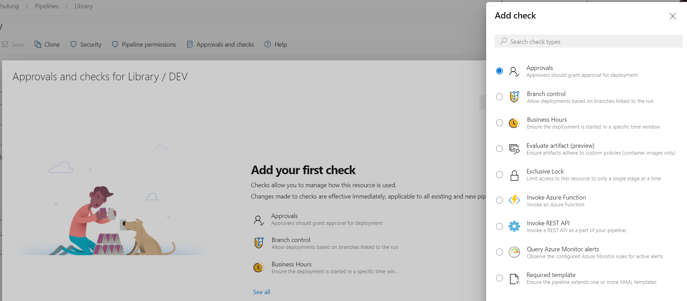
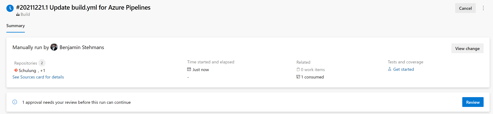
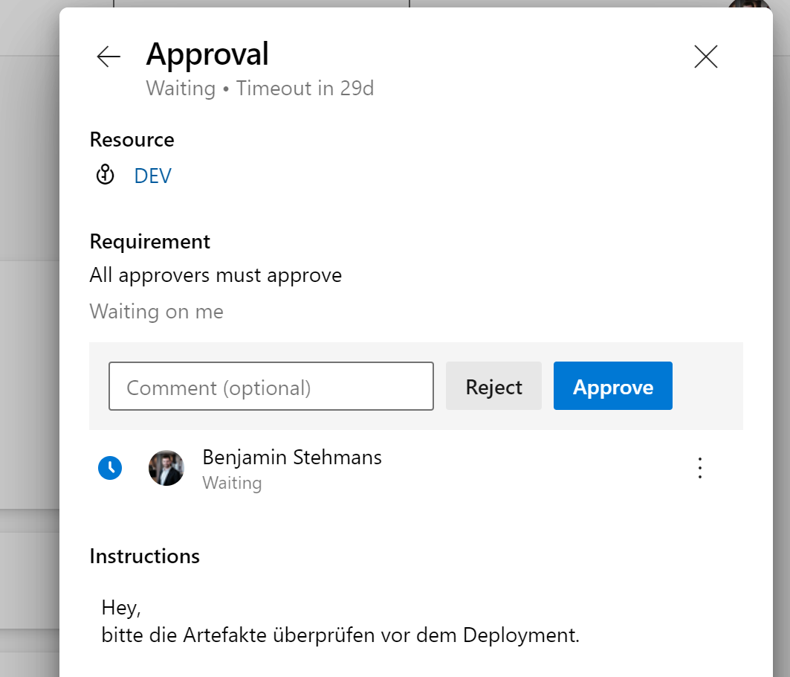

# Approvals

Manchmal ist es notwendig einen Prozess beim Kunden einzuhalten. Tests müssen ausgeführt werden oder bestimmte Fachbereiche müssen einem Deployment zustimmen. Dies kann mithilfe von Checks innerhalb von Environments, Service Connections, Repositorys, Variable Groups, Secure Files und Agent pools realisiert werden.

- [Approvals](https://docs.microsoft.com/en-us/azure/devops/pipelines/process/approvals?view=azure-devops&tabs=check-pass#approvals)  

- [Branch control](https://docs.microsoft.com/en-us/azure/devops/pipelines/process/approvals?view=azure-devops&tabs=check-pass#branch-control)  
- [Business hours](https://docs.microsoft.com/en-us/azure/devops/pipelines/process/approvals?view=azure-devops&tabs=check-pass#business-hours)  
- [Invoke Azure function](https://docs.microsoft.com/en-us/azure/devops/pipelines/process/approvals?view=azure-devops&tabs=check-pass#invoke-azure-function)  
- [Invoke REST API](https://docs.microsoft.com/en-us/azure/devops/pipelines/process/approvals?view=azure-devops&tabs=check-pass#invoke-rest-api)  
- [Query Azure Monitor Alerts](https://docs.microsoft.com/en-us/azure/devops/pipelines/process/approvals?view=azure-devops&tabs=check-pass#query-azure-monitor-alerts)  
- [Required template](https://docs.microsoft.com/en-us/azure/devops/pipelines/process/approvals?view=azure-devops&tabs=check-pass#required-template)  
- [Evaluate artifact](https://docs.microsoft.com/en-us/azure/devops/pipelines/process/approvals?view=azure-devops&tabs=check-pass#evaluate-artifact)  
- [Exclusive lock](https://docs.microsoft.com/en-us/azure/devops/pipelines/process/approvals?view=azure-devops&tabs=check-pass#exclusive-lock)  

## Aufgabe
Erstellt in der DEV Variable Group ein Approval für die Pipeline und lasst die Pipeline anschließend laufen.

    
  

## Links
[Pipeline deployment approvals - Azure Pipelines | Microsoft Docs](https://docs.microsoft.com/en-us/azure/devops/pipelines/process/approvals?view=azure-devops&tabs=check-pass)  
