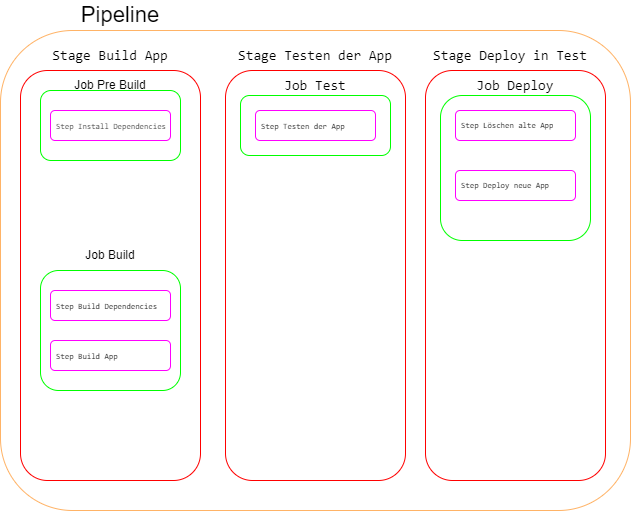

# YAML Schemareferenz

## Pipeline structure

Eine Pipeline in Azure DevOps besteht aus einer oder mehreren Stages, die den CI/CD-Prozess definieren. Stages sind die zentralen Abschnitte einer Pipeline und repräsentieren wichtige Etappen im Deploymentzyklus. Beispiele für Stages sind "Build App", "Testen der App" und "Bereitstellung in Test".

Innerhalb einer Stage können Stages definiert werden, die wiederum ein oder mehrere Jobs enthalten. Stages sind logische Gruppierungen von Jobs, die auf dem gleichen Computer ausgeführt werden können. Die Anordnung von Stages und Jobs kann in Abhängigkeitsdiagrammen festgelegt werden, z. B. "Führe diese Phase vor dieser Phase aus" oder "Dieser Job ist abhängig von der Ausgabe dieses Jobs".

Ein Job ist eine lineare Abfolge von Steps, die verschiedene Aufgaben, Skripte oder Verweise auf externe Vorlagen ausführen können. Die YAML-Datei strukturiert sich entsprechend dieser Hierarchie:



```yaml
- Pipeline
    - Stage Build App
        - Job Pre Build
            - Step Install Dependencies
        - Job Build
            - Step Build Dependencies
            - Step Build App
    - Stage Testen der App
        - Job Test 
            - Step Testen der App
    - Stage Bereitstellung in Test
        - Job Deploy
            - Step Löschen alte App
            - Step Deploy neue App
```

Es ist wichtig zu beachten, dass nicht alle Ebenen dieser Hierarchie für einfache Pipelines zwingend erforderlich sind. In einem einfachen Builds können Phasen und Jobs möglicherweise ausgelassen werden, da nur Steps vorhanden sind. Viele der in diesem Abschnitt gezeigten Optionen sind optional und haben bereits sinnvolle Standardwerte. Daher ist es unwahrscheinlich, dass alle möglichen YAML-Definitionen in Ihrer Konfiguration enthalten sind.

**Beispiel einer Pipeline:** 


### Trigger
```yaml
trigger: 
- main
```

Ein Trigger gibt an wann eine Pipeline gestartet wird. 
Möglichkeiten sind:
- Push trigger
- Pull request trigger
- Scheduled trigger
- Pipeline trigger

###  Pool
```yaml
pool:
  vmImage: ubuntu-latest
```

Ein Pool gibt an, wo und auf welchem OS die Phase ausgeführt wird. Möglichkeiten sind: 
- Windows-latest
- ubuntu-latest
- macOS-latest
- Selfhosted

### Steps

```yaml
steps:
- script: echo Hello, world!
  displayName: 'Run a one-line script'

- script: |
    echo Add other tasks to build, test, and deploy your project.
    echo See https://aka.ms/yaml
  displayName: 'Run a multi-line script'

```

Steps sind eine Abfolge von Vorgängen. 
Alle Tasks unterstützen die folgenden Eigenschaften:   
- displayName  
- condition  
- continueonerror  
- enabled  
- env  
- timeoutInMinutes  

Eine Aufgabe ist das Herzstück der Pipeline, sie führt die gewünschte Funktion aus.
Möglichkeiten sind:  
- [PowerShell Task](https://docs.microsoft.com/en-us/azure/devops/pipelines/tasks/utility/powershell?view=azure-devops)  
- [Copy Files Task](https://docs.microsoft.com/en-us/azure/devops/pipelines/tasks/utility/copy-files?view=azure-devops&tabs=yaml)  
- [Azure PowerShell task](https://docs.microsoft.com/en-us/azure/devops/pipelines/tasks/deploy/azure-powershell?view=azure-devops)  
- [Publish Build Artifacts task](https://docs.microsoft.com/en-us/azure/devops/pipelines/artifacts/pipeline-artifacts?view=azure-devops&tabs=yaml)  
- [Python Script task](https://docs.microsoft.com/en-us/azure/devops/pipelines/tasks/utility/python-script?view=azure-devops)  


## Links
[Catalog of the built-in tasks for build-release and Azure Pipelines & TFS - Azure Pipelines | Microsoft Docs
](https://docs.microsoft.com/en-us/azure/devops/pipelines/tasks/?view=azure-devops)

[YAML schema - Azure Pipelines | Microsoft Docs
](https://docs.microsoft.com/en-us/azure/devops/pipelines/yaml-schema?view=azure-devops&tabs=schema%2Cparameter-schema) 

## Glossar

| Begriff | Erklärung | Position | 
|--- | --- | --- | 
| Resources | Eine Ressource ist ein externer Dienst, der als Teil der Pipeline genutzt wird.| <font color="green">Header</font> | 
| Triggers | Ein Trigger legt fest, welche Zweige oder Zeiten einen Build  auslösen.|  <font color="green">Header</font> | 
| Pool | Ein Agentenpool in Azure DevOps ermöglicht es, mehrere Build- und Release-Agents in einer Gruppe zu organisieren, die gemeinsame Konfigurationseinstellungen und Sicherheitseinstellungen teilen. Dies erleichtert die Verwaltung und Skalierung der Build- und Release-Infrastruktur.|  <font color="green">Header</font> | 
| Stage | Eine Phase ist eine Sammlung von zusammenhängenden Aufträgen. Standardmäßig werden Schritte sequentiell ausgeführt. Jede Stufe beginnt erst, wenn die vorhergehende Stufe abgeschlossen ist, es sei denn, über die Eigenschaft dependsOn wird etwas anderes angegeben.| <font color="red">Body</font> | 
| Job | Ein Job ist eine Sammlung von Schritten, die von einem Agenten oder auf einem Server ausgeführt werden. Aufträge können unter bestimmten Bedingungen laufen und von früheren Aufträgen abhängen. | <font color="red">Body</font> | 
| Step | Ein Step ist eine lineare Abfolge von Vorgängen, aus denen ein Auftrag besteht. Jeder Step läuft in einem eigenen Prozess auf einem Agenten und hat Zugriff auf den Pipeline-Arbeitsbereich auf einer lokalen Festplatte.|  <font color="red">Body</font> | 
| Task | Tasks sind die Bausteine einer Pipeline. |  <font color="red">Body</font> | 
|Publish | Das Schlüsselwort publish ist eine Abkürzung für die Aufgabe Publish Pipeline Artifact. Mit dieser Aufgabe wird eine Datei oder ein Ordner als Pipeline-Artefakt veröffentlicht (hochgeladen), das von anderen Aufträgen und Pipelines verwendet werden kann. | <font color="red">Body</font> | 
| Download | Das Schlüsselwort download ist eine Abkürzung für die Aufgabe Pipeline-Artefakte herunterladen. Die Aufgabe lädt Artefakte herunter, welche mit dem aktuellen Lauf oder von einer anderen Azure-Pipeline, die als Pipeline-Ressource zugeordnet ist, verbunden sind.| <font color="red">Body</font> | 
| Checkout | Aufträge, welche nicht der Bereitstellung dienen, checken automatisch den Quellcode aus. | <font color="red">Body</font> | 

